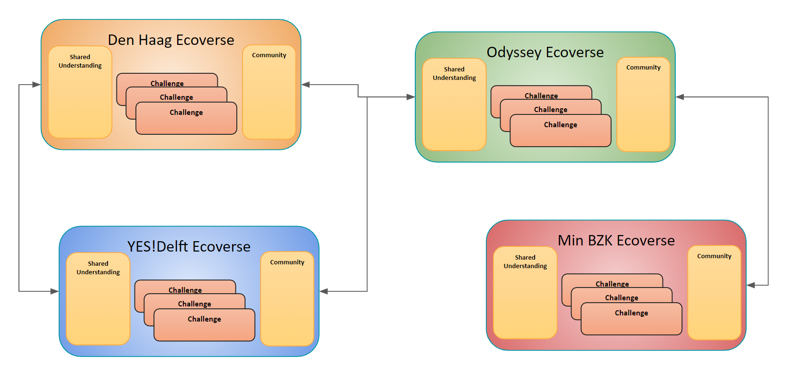

# **Introduction**

This is a working document intended to capture key concepts and terminology that are used within the context of CherryTwist. 

As these concepts are used throughout CherryTwist it is important for anyone new to CherryTwist to be familiar with the contents of this document.

# **Challenge: A Journey with many steps**

The central concept in CherryTwist is the *Challenge* - a complex problem / change to be realised and involving multiple stakeholders. 

It is a _*journey*_, whereby those invovled in the challenge will need to work together to realise steps in the right direction. 

All other concepts / activities in CherryTwist are to support the realising of Challenges - from the activities on the journey, to the community that builds up around the Challenge. In some sense it is the placement of the Challenge as being _the_ heart of CherryTwist that sets it apart.

## Projects: Steps on the Journey
The term used within CherryTwist for the steps on the Challenge journey is *Project*, whereby a set of participants collaborate within the context of a Challenge towards a clearly defined outcome. 

A Project can represent many different types of steps on the journey; critical is that it has a clear outcome (scope), a timeline, and specifies the resources available.  

Example Projects include:
* Challenge Defintion: clearly formalising the challenge
* Community Building: promoting the challenge and helping match contributors
* Hackathon: bringing people together to work on prototype solutions in the context of the Challenge
* Pilot: delivering a working solution (as defined by the scoping Project scope)

# **Challenge Building Blocks**
The following building blocks are integral to a Challenge:
* Shared Understanding: The shared context for the Challenge
* Community: The users that are involved in the Challenge, in various roles
* Resources: The resources controlled by the Challenge, primarily money in terms of being able to fund Projects where needed but also work products that are the outputs of Projects
* Projects: The set of clearly defined steps on the Challenge journey, between participants in the Challenge.

## Shared Understanding: Definition, Roles & Agreements
Any complex Challenge will require many actors, each with their own persepective and context, to be involved. Given that a Challenge is a journey it can also be expected that the And the nature / involvement of actors evolves over time.

As such it is critical that the *Shared Understanding* of the Challenge is clearly captured - and that this Shared Understanding evolves as the Challenge evolves. 

The Shared Understanding has many aspects to it:
* Definition: A clear and agreed statement as to what is to be addressed by the Challenge
* Roles: The identified roles in the context of the Challenge
* Agreements: The agreements that have been made within the participants of a Challenge 

### Definition
The ability to clearly and comprehensively capture the current understanding of the Challenge gives clarity to participants in the Challenge, and also allows new potential participants to decide if / how they will engage.

The definition represents the current understanding of the challenge - so it will evolve. 

### Roles
A Challenge needs a community contributing to it, and that community likely will have multiple types of actors contributing to progressing the Challenge journey. 

The set of Roles for a Challenge captures the key generic roles around the Challenge - including the expectations / privilidges associated with each Role. 

### Agreements
For all those participating in a Challenge it is important that the set of Agreements that have been made in the context of the Challenge are explicit. It helps ensure actions are aligned, which also avoiding confusion / mis-understandings.

Think in terms of generic agreements around the Challenge, community principles / stated values etc. 
The type of Agreements that can be made are varied. Examples include:
* Social Norms: What are the expectations regarding behaviour within the community?
* Principles / Statements of Intent: What  The ability to formalise the Agreements between participants in the Challenge 
* Project Frameworks: Master agreements that can be used as context for the definition of Projects

# **Ecoverse: Challenge Hosting**
The formation of a community around a Challenge requires a careful nurturing hand and hosting in an environment with the right "ingredients"- especially in the early formation stages but also potentially throughout the lifecycle of the Challenge. This hosting environment is focused on maximising the chances of Challenge success, and is called an  "Ecoverse".

Why the term Ecoverse? In many ways a Challenge can be viewed as a "Digital Ecosystem" i.e. a complex interactions that take place between the various actors involved in a challenge. And typically multiple Challenges are hosted in the same location - hence the term "Ecoverse". 

Note: an Ecoverse is actually also a Challenge, so it inherits also all the building blocks that come together for a Challenge i.e. Shared understanding, community, projects etc.  

=================================

__Why do we need an Ecoverse?__

**Challenges are _hard_**
The analogy here is with the startup world where there is a wealth of resources available to help: fiinancing initiatives, knowledge bases, best practices, incubators etc. However despite all this support, only a small portion of startups actually succeed. 

Now consider a Challenge, which by its very nature represents multiple types of actors that need to collaborate to achieve the desired goals. The complexity rises exponentially in the number / types of interactions involved - yet the resources to support these types of collaborations is very limited. It remains a fine art to realise a successful Challenge, with the successful examples depending heavily on special circumstances and / or extremely talented individuals with the right balance of capabilities to make the change happen. 

**Right Ingredients**
To maximise the changes of realising the desired goals from a Challenge, it is critical to embed the Challenge within a wider community posessing the right balance of skills, drive and understanding to nurture in particular the early stages of the Challenge journey. 

As such the design of CherryTwist has at its core the notion of an Ecoverse - a hosting community that helps the formation and early incubation of a Challenge. 

================================

An additional concept that may help convey the importance of Ecoverse is the notion of DNA - whereby the "DNA" from the Ecoverse host is used to help establish the right ingredients (community) and culture within hosted Challenges. 

## Ecoverse Services
The Ecoverse is active in facilitating the Challenges it is hosting, ensuring that the Challenges have access to the right services to help the Challenge make progress. These services may be provided directly by the the organisation running the Ecoverse but potentially by other curated service providers.

# **CherryVerse: connected Ecoverses**
The expectation is that over time a number of Ecoverses will be established - each with their own "ingredients & recipes" for the Challenges that they host. The types of Challenges hosted in each Ecoverse may also differ e.g. there can be socially driven challenges, or a government could decide to host their own Ecoverse to facilitate Challenges involving public-private cooperation. 

