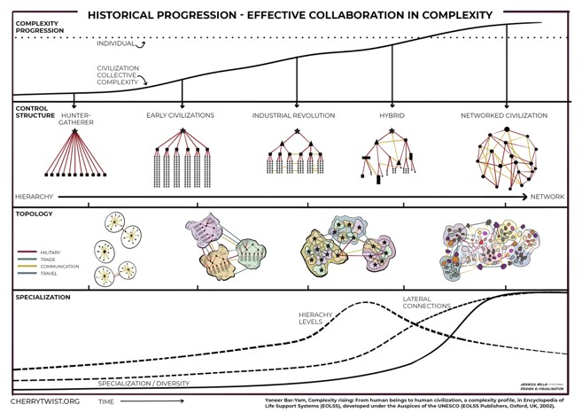

# Cherrytwist - Challenge Management Platform 
Welcome to CherryTwist - an open source platform for managing Challenges that allows you to: 

* Manage the full lifecycle of innovation challenges, in a single, shared representation
    * Challenges: Scope, publish, campaign
    * Project portfolio: Initiate, (co)fund and govern projects
    * Grants: (crowd)fund, award and govern, keep track of results and paper-trail
* Community: Engage and grow your community
    * Onboard stakeholders and talented / motivated contributors, increase diversity of contributions
    * Enable exchange of capabilities, expertise and knowledge
* Enable sharing & learning within and between communities
* Self sovereign / decentralisation ready (web 3 under the hood)

This repository is for coordination around the project. The project is developing rapidly, and we aim to get the basics right from the get go so please do share any feedback / observations / suggestions you have!

#  What is the problem?
Managing challenges is hard:
* Many parties involved, different backgrounds
* Fragmented best practices / community 
* Ad-hoc tooling
* Ensuring lifecycle continuity
* Facilitating collaboration & tracking progress
* Perceptions & agendas
However increasingly the problems that society needs to addres __are complex challenges__. 

The complexity of our society is simply rising and we need to find new ways to collaborate effectively to address them. 

Realising a platform to facilitate complex challenges is ambitious - but one that can deliver huge value...a step change in how we collaborate!

If you are interested in getting involved please reach out and connect via <info@cherrytwist.org>!

# How is Cherrytwist built? 
The set of concepts and terms used for the design of CherryTwist can be found inour [Conceptual Design](./Design/ConceptualDesign.md). It is important to read this document first, as a lot of the terminology used in the rest of the design documentation as well as the code is described here - so having this mental model clear helps. 

A high level technical design for CherryTwist can be found in our [Technical Design](./Design/TechnicalDesign.md).

A key goal of the platform is to leverage the latest technical capabilities such as Self Sovereign Identity, verified credentials (trust, reputation), formalised agreements via smart contracts etc etc - without exposing those details to the end user!

# Community Guidelines
- Contributing: please read the **[guidelines](https://github.com/cherrytwist/.github/blob/master/CONTRIBUTING.md)** and check the **[backlog](https://app.zenhub.com/workspaces/cherrytwist-5ecb98b262ebd9f4aec4194c/board)** for open issues.
- Licensing: all contributors to the project are required to sign a **[Contributor License Agreement (CLA)](https://github.com/cherrytwist/.github/blob/master/CLA.md)** to ensure that the contents of the repository are covered from a legal perspective. The CLA process is enforced for all contributions.
- Security: the project is enforcing 2FA, and our **[security process](https://github.com/cherrytwist/.github/blob/master/SECURITY.md)** details out what to do in the event of a vulnerability being detected

And last but not least, please feel free to reach out and **[ask us for support!](https://github.com/cherrytwist/.github/blob/master/SUPPORT.md)**

## Developers
Want to contribute to CherryTwist? The best place to start is by looking at the Developer documentation in the [Developer Folder](./Developers/README.md) in this repo.

## Thank you to the following contributors
- valentinyanakiev
- atstoyanov
- comoque1
- ReneHonig
- aaitor
- GhostOnTheFiber
- wordsmyth73

