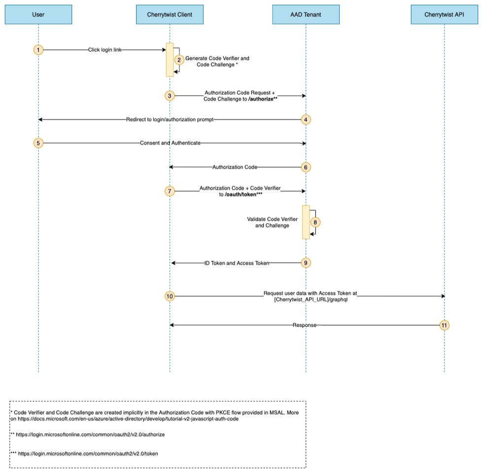
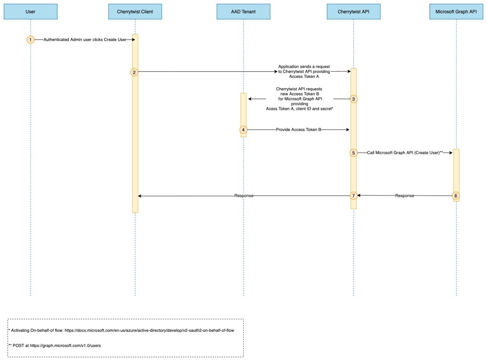

# Cherrytwist Security Design

##	Main design principles
The main principles around the CT security design are:
* HTTPS for transport security on all traffic on public networks
* Minimal network surface exposure – all traffic goes through the Kubernetes Ingress controller
* Authorization is token-based via Identity Provider (at the moment Azure Active Directory)
* Routing to the Identity Provider endpoints is done via standard 3rd party libraries
    * For Cherrytwist Client.Web – Microsoft Authentication Library for JavaScript (MSAL.js)
    * For Cherrytwist Server – Passport.js
* Database is secured via user:password. The database endpoint is accessible only inside the Kubernetes network.
* Accessing 3rd party APIs requires obtaining API specific access token.

 
Fig.1 Cherrytwist Security Overview

 
##	Authentication
###	Cherrytwist Web Client Authentication

 
Fig.2 Authorization Code Flow with Proof Key for Code Exchange

The Cherrytwist Client authentication uses the Authorization Code Flow with Proof Key for Code Exchange(PKCE). It takes advantage of the MSAL.js library built-in integration with AAD. 

The main steps of the flow are highlighted on the diagram above. 

Authorization endpoints are configured via config file and environment variables. PKCE is provided by the library. There are two ways to consent (step 5) – either User consent (via callback from AAD) or Admin consent(done directly in the AAD admin portal). After consent is provided the flow continues and two tokens are provided – an ID Token and an Access Token. 

The Access Token is passed as a Bearer token in the Authorization HTTP header (e.g. a header in the form of ‘Bearer [access_token]’). The bearer token is used in the Cherrytwist Server to authorize Cherrytwist API calls.

NB! If any of the calls / callbacks aren’t strictly followed the flow will be altered and it will not work.

###	Cherrytwist Server calling Microsoft Graph API

Cherrytwist Server uses the On-Behalf-Of flow to call Microsoft Graph API. The Access Token received from the Cherrytwist Client (from the Auth Code with PKCE flow) is replaced with a new call to AAD for a new token to access the Microsoft Graph API.
 
##	Authorization
The following roles are used within the context of the Cherrytwist platform:
* **Anonymous** - Able to access non-authenticated elements of the query api. To include ecoverse name/context, list of challenges + for each challenge the context of the challenge. Never be able to access any mutations, nor read access to any details of users / user groups.
* **Ecoverse Member** - Able access to the full query api. Able to see community details of the challenges that the user is a member of. Able to edit their own user profile.
* **Ecoverse Community Admin** - Able to add users, add /remove users to groups
* **Ecoverse Admin** - Delete users, create/delete groups, create/delete challenge, able to fill any roles for each challenge
* **Global Admin** - Full access for both Cherrytwist API and AAD.

The above roles are managed via membership of a restricted set of UserGroups at the Ecoverse level i.e. there is a "Community-Admins" group and users that are members of that group will inherit the Community-Admin role. 

On Cherrytwist server startup a file is loaded that specifies a default set of users to go into the authorisation groups.

##	Group mapping to API calls

**Queries**

| Entity                        | API Call EndPoint    | Minimum Authorisation Level  | Notes             |
| ----------------------------- | -------------------- | ---------------------------- | ----------------- |
| Ecoverse         | name           | anonymous | |		
|	 | host         |	anonymous	 | |
|	 | context	    |anonymous	    | |
|	 | user         |	community-admin	 |  |
|	 | users	    |community-admin | |
|	 | group	    |community-admin |	  |
|	 | groups       |	community-admin	 | |
|	 | groupsWithTag |	community-admin	 |  |
|	 | challenges   |	anonymous   |	Only the descriptive elements are visible, not the community  |
|	 | challenge	 | anonymous |	Only the descriptive elements are visible, not the community |
| 	 | organisations | anonymous	 |Only the descriptive elements are visible, not the community |
|	 | organisation  | anonymous |	 Only the descriptive elements are visible, not the community |
|	 | tagset	    | anonymous	 |  |
|    |	me	        | ecoverse-members	 | User must have an account. |
| Challenge |	name	        | anonymous	 | |
|  |	context	        | anonymous	 | |
|  |	contributors	        | community-admin	 | To be visible later to challenge members|
|  |	groups	        | community-admin	 | To be visible later to challenge members|
| Organisation |	name	        | anonymous	 | |
|  |	contributors	        | community-admin	 | To be visible later to challenge members|
|  |	groups	        | community-admin	 | To be visible later to challenge members|
 
Note: the above is not a comprehensive list of all fields / entities but it intended to give an overview of the authorisation levels needes to access the different types of information managed by the Cherrytwist server.

**Mutations**

| Entity                        | API Call EndPoint    | Minimum Authorisation Level  | Notes             |
| ----------------------------- | -------------------- | ---------------------------- | ----------------- |
| Ecoverse| 	createGroupOnEcoverse	| ecoverse-admin	| | 
| | 	updateEcoverse	| ecoverse-admin	| | 
| | 	createUser	| community-admin	| | 
| | 	removeUser	| community-admin	| | 
| | 	createChallenge	ecoverse-admin	| | 
| | 	createOrganisation	ecoverse-admin	| |
| UserGroup	| addUserToGroup| 	community-admin	| | 
| |	removeUserFromGroup	| community-admin	| | 
| |	assignGroupFocalPoint	| community-admin	| | 
| |	removeGroupFocalPoint	| community-admin	| | |
| User| 	updateUser| 	community-admin	| | 
| Challenge	| createGroupOnChallenge| 	community-admin	| | 
| | 	updateChallenge	| ecoverse-admin	| | 
| | 	addUserToChallenge| 	community-admin	| | 
| Organisation	| createGroupOnOrganisation	| community-admin	| | 
| | 	updateOrganisation| 	ecoverse-admin	| | 
| Profile	| createTagsetOnProfile	| community-admin	| | 
| | createReferenceOnProfile	| community-admin	| | 
| Tagset	| replaceTagsOnTagset	| community-admin	| | 
| | 	addTagToTagset| 	community-admin	| | 

