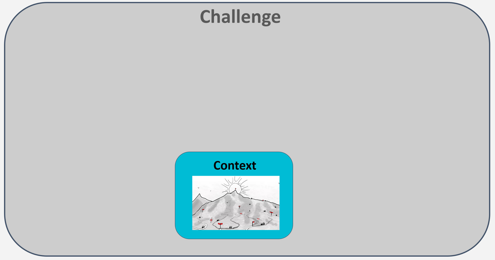
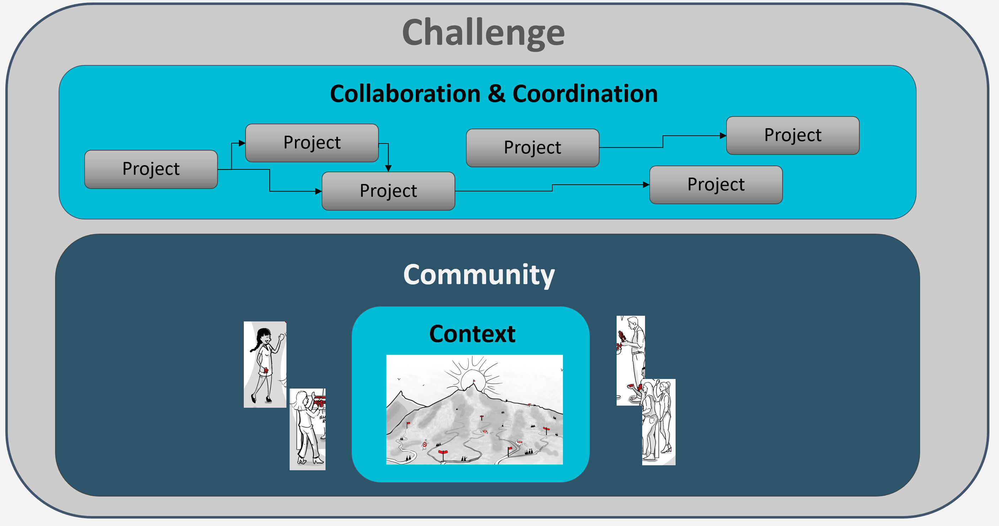

# **Introduction**

This is a working document intended to capture key concepts and terminology that are used within the context of Alkemio. 

As these concepts are used throughout Alkemio, it is important for anyone new to Alkemio to be familiar with the contents of this document.

# **Challenge: A dissatisfaction with the current reality**

The central concept in Alkemio is the *Challenge* - a dissatisfaction with the current reality, around which multiple parties collaborate over a longer period of time to make progress.  

It is a _*journey*_, whereby those invovled in the challenge will need to work together to realise progress.. 

    

All other concepts / activities in Alkemio are to support the realisation of Challenges - from the activities on the journey, to the community that builds up around the Challenge, to the collaboration that takes place around the shared representation of the Challenge. 

### Creating the map, together

And with any journey, having as complete as possible representation of the route to the destination is important to choosing the right next steps - essentially we need a _*Map*_. However at the moment the pieces of the Map are held by different people and not in a joined up representation. The Map helps you know where you are heading as well as finding the right companions for the journey. This needs to be a shared representation.

It is the placement of the Challenge as being _the_ heart of Alkemio that sets it apart.

## What are the core elements of a Challenge?

### Context
At the heart of a Challenge, and providing the foundation from which the Challenge progresses, is the _*Context*_. 

The Context has multiple elements:
* The shared understanding of the current situation and desired outcomes
* Relevant knowledge / information that has already been gathered 
* Agreements / principles that goven how parties collaborate towards the desired outcome. 

The ability to clearly and comprehensively capture the current understanding of the Challenge gives clarity to participants in the Challenge, and also allows new potential participants to decide if / how they will engage.

For all those participating in a Challenge it is important that the set of Agreements that have been made in the context of the Challenge are explicit. It helps ensure actions are aligned, which also avoiding confusion / mis-understandings. Think in terms of generic agreements around the Challenge, community principles / stated values etc. The type of Agreements that can be made are varied. Examples include:
* Social Norms: What are the expectations regarding behaviour within the community?
* Principles / Statements of Intent: What  The ability to formalise the Agreements between participants in the Challenge 
* Legal context: Any legal infrastructure / setup that should be used for collaboration

The Context represents the current understanding of the challenge - so it will evolve. 

### Community
Around the Context is the _*Community*_, the people and organisations who wish to contribute to the achieving the desired outcomes. 

A Challenge needs a community contributing to it, and that community likely will have multiple types of actors contributing to progressing the Challenge journey. 

The set of Roles for a Challenge captures the key generic roles around the Challenge - including the expectations / priviliges associated with each Role. 

### Collaboration
The Community uses the shared Context to _*Collaborate*_, working together towards the desired outcomes. 

The activities taken over the Challenge lifecycle will vary depending on the phase / needs of the Challenge, and examples include:
* Challenge Defintion: clearly formalising the challenge
* Community Building: promoting the challenge and helping match contributors
* Hackathon: bringing people together to work on prototype solutions in the context of the Challenge
* Pilot: delivering a working solution (as defined by the scoping Project scope)

### Continuity
Each Challange, as well as sub levels such as Opportunity, have a lifecycle. They are identified, are evolved via various activities and hopefully ultimately the desired outcomes are realised. Of course the Challenge could also be abandoned - but that should be an explicit choice. 

However all too often Challenges tend to simply fizzle to a halt: there is a lot of initial energy and enthusiasm, leading up to hackathons or similar events - but then further progress is very hard to realize. 

The goal should be to ensure that the Challenge progress can continue and be tracked over the full lifecycle - which is captured under the term _*Continuity*_.

By managing a representation of the Challenge that is shared by the community of the Challenge, it is easier to keep the continuity as the Challenge progresses.

# **Ecoverse: Challenge Hosting**
_Ecoverse_ is a contraction of the words "ecosystem" and "universe". It is where Challenges are hosted, providing a shared base context and community as well as facilitating the collaboration within and between hosted Challenges. 

The expectation is the the community for the Ecoverse is curated, and provides the hosted Challenges with the right "ingredients"- especially in the early formation stages. 

Note: an Ecoverse is actually also a Challenge, so it inherits also all the building blocks that come together for a Challenge i.e. Shared understanding, community etc.  

=================================

__Why do we need an Ecoverse?__

**Challenges are _hard_**
The analogy here is with the startup world where there is a wealth of resources available to help: fiinancing initiatives, knowledge bases, best practices, incubators etc. However despite all this support, only a small portion of startups actually succeed. 

Now consider a Challenge, which by its very nature represents multiple types of actors that need to collaborate to achieve the desired goals. The complexity rises exponentially in the number / types of interactions involved - yet the resources to support these types of collaborations is very limited. It remains a fine art to realise a successful Challenge, with the successful examples depending heavily on special circumstances and / or extremely talented individuals with the right balance of capabilities to make the change happen. 

**Right Ingredients**
To maximise the changes of realising the desired goals from a Challenge, it is critical to embed the Challenge within a wider community posessing the right balance of skills, drive and understanding to nurture in particular the early stages of the Challenge journey. 

As such the design of Alkemio has at its core the notion of an Ecoverse - a hosting community that helps the formation and early incubation of a Challenge. 

================================

An additional concept that may help convey the importance of Ecoverse is the notion of DNA - whereby the "DNA" from the Ecoverse host is used to help establish the right ingredients (community) and culture within hosted Challenges. 

## Challenge Services
The Alkemio paltform enables the management of Challenges over their full lifecyle. Challenges are hosted within an Ecoverse - which in turn is hosted by a host organisation. 

The platform provides the full lifecycle management, but there are many other activities / services that can be provided to help Challenges on their journey. These services / activities can be provided directly by the Challenge Host organisation, or by other curated service parties that are active within the Ecoverse.  .

# **Shared Community across Ecoverses**
The expectation is that over time many Ecoverses are created, each with their own "ingredients & recipes" for the Challenges that they host. The types of Challenges hosted in each Ecoverse may also differ, e.g. there can be socially driven challenges, or a government could decide to host their own Ecoverse to facilitate Challenges involving public-private cooperation. 

Key is that the community that is engaged on Challenges within a particular Ecoverse is also able to connect to other Challenges hosted in other Ecoverses.

