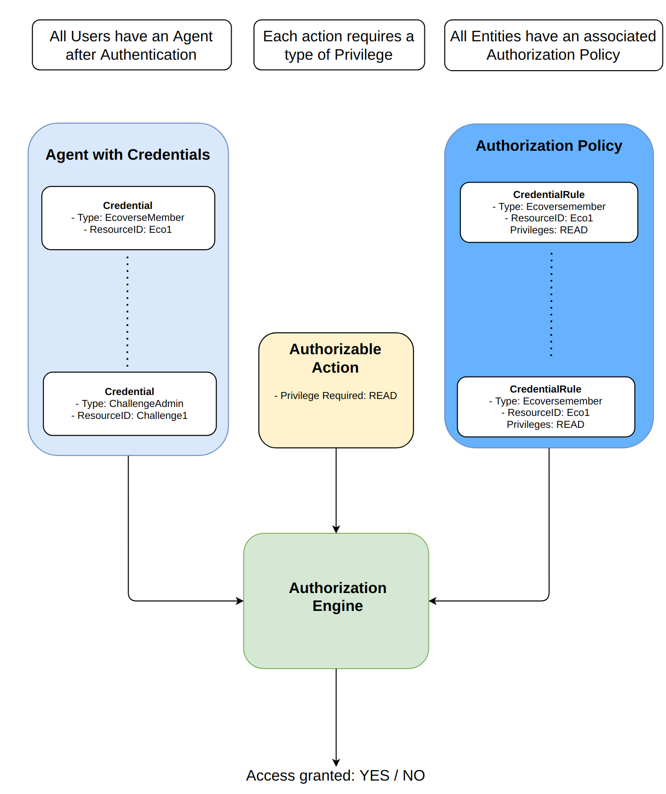

# Credential Based Authorization
This document provides a detailed overview of how Credentials are used for Authorization within the Alkemio platform. 

The high level design for the Authorization Framework is shown below. 

It is important to note that while the set of Credentials held by an Agent is expected to be dynamic and evolve with platform usage, the Authorization Policies are expected to not change often. 

## **Why use Credentials? Are Access Control Lists / Groups not enough?**
To operate the platform in a decentralized manner, the Authorization framework used cannot rely on centralized access control. Given the platforms focus on SSI, the choice was made to move to using Credentials for the authorization of all actions on the platform.  

It is important to understand how this is different. Most systems tend to use a form of access control lists for managing roles, which then determines what access and actions could be carried out. All role assignment is then done centrally. This is fundamentally different than using Credentials for Authorization. A simple analogy to explain the difference: a person wants to get access to a conference:
* **Access Control Lists**: the person goes to the conference entrance, and identifies themselves. Their identity is checked against a list at the door by the representative. If the *identity* is on the list the user is granted access.
* **Credentials**: the person goes to the conference entrance, and presents a *credential* tied to their identity. If that credential is valid, and the conference rules state that a person holding a valid instance of that credential can access the conference, then the person is granted access.

Note that the latter is inherently more scalable and decentralized as there is not a centralized list that is used at the entrance to the conference. 

The medium term goal is to move to using full SSI with Verified Credentials. However as an intermediate step the platform uses a lightweight implementation of non-verified Credentials (i.e. not cryptographically secure and managed by the platform). This works as the platform is still centralized but it is important to switch already to Credential based authorization now so that the path to using decentralized authorization is clear. 

## **Terminology**
The terminology used within Alkemio for Credential Based Authorization has borrowed heavily from initiatives such as [Cability Based Authorization System](https://essif-lab.eu/capability-based-authorization-system-by-jolocom/). This is to both learn from the experience within the wider SSI field, as well as to make the subsequent move to using Verified Credentials easier. 

Terms:
* **Credential**: a combination of a **Type** and **Resource** that can be assigned to an Agent.  
* **Resource**: the Entity __to__ which the credential is bound e.g. Challenge
* **Privilege**: A particular type of access that can be granted (e.g. create, update, read, delete, grant etc)
* **Authorization Policy**: contains a set of rules that specify which access (i.e. what privileges) is grated to Credentials that match the rule criteria. Each entity has its own Authorization Policy.

Later, as there is wider integration into external trust sources, the intention is to also define a **Trust Framework**: a definition of privileges and how access is delegated in the system

Note: For now the Subject is implicit in Alkemio by virtue of the Credential being held by the Agent representing the User. For Verified Credentials this needs to be part of the cyrptographically secured credential. 

Note: the implementation of Credentials is generic, and not tied to Authorization i.e. other Credential types could easily also be stored in the same mechanism. 

## **Credential Types**
There are multiple credential types in use within Alkemio. Note that in the text below when we say that "an Organization holds a Credential", this in fact represents that the Agent acting on behalf of an Organization holds a Credential.

### **Global Roles**
These credentials do not have a resource ID specified as they are applicable regardless of context. 
* _RegisteredUser_: for users that are registered on the platform
* _GlobalAdmin_: for the platform administrators, including management of global credentials
* _GlobalAdminHubs_: for platform administration of hubs
* _GlobalAdminCommunity_: for platform administration of contributors

Note that the root role is Global Admin, which is able to manage the other global roles (Global Admin Hubs, Global Admin Community) and is a pure superset of the privileges assigned to those roles. The expected usage is that there is a small set of Global Admins, with potentially a larger set of Global Admin Hubs that facilitate usage of the platform by helping Hub Admins.  

### **Context Dependent Roles**
These are roles that are specific to a context (resourceID) on the platform. Some of the roles are only applicable to e.g. Organizations, but others are applicable to both Users and Organizations. In that case we use the term Contributor.

Example roles: 
* _HubMember_: to identify a Contributor as being a Member of a Hub
* _HubHost_: to identify a Contributor as being a Host of a Hub. 
* _HubAdmin_: to identify a User as being an Admin of an Hub
* _ChallengeMember_: to identify a Contributor as being a Member of a Challenge
* _ChallengeLead_: to identify a Contributor as being aa Lead of a Challenge
* _ChallengeAdmin_: to identify a User as being aa Admin of a Challenge
* _OpportunityMember_: to identify a Contributor as being a Member of a Opportunity
* _OpportunityLead_: to identify a Contributor as being a Lead of a Opportunity
* _ChallengeAdmin_: to identify a User as being aa Admin of a Challenge
* _UserSelfManagement_: to identify the User as being able to manage their own Profile

An example: consider a User that holds the following Credential:
- Type: HubMember
- ResourceID: Challenge6

This User is then a member of Challenge6, but clearly is *not* a member of Challenge7.

### **Relationships**
In addition, some key relations are also represented by Credentials. Whilst currently these credentials are used to manage relationships, it is expected that near term that these credentials will also enable certain actions on the platform. 
* _HubHost_: when held by an Organization, it is used to identify that they are the host for a particular Hub
* _ChallengeLead_: held by an Organization to identify that they are the host for a particular Challenge.

## **AuthorizationPolicy**
Each entity upon which a User can carry out action on the Alkemio platform has associated with it an AuthorizationPolicy. Each AuthorizationPolicy contains a set of **rules** that determine what Privileges are granted to a particular agent. The set of rule types include:
* _Credential Rules_: Grant a set of privileges if an agent has a Credential matching the criteria
* _Verified Credential Rules_: Grant a set of privileges if an agent has a VerifiedCredential matching the criteria
* _Privilege Rules_: Grant a set of privileges if the previous rules have already resulted in the agent being granted a particular Privilege. E.g. Grant the user the Privilege to CREATE_CANVAS if the user has the Privilege CREATE.

As can be seen, when an action is to take place the first step is to determine what Privileges are assigned to an Agent based on the Credentials held by the Agent - and then check if the required Privilege is included in the assigned set of Privileges. 

Finally, each rule in an AuthorizationPolicy can also be inherited by child entities. 

### Credential Rules
An AuthorizationPolicy contains a set of CredentialRules. Each CredentialRule specifies:
* Criteria for a Credential to match e.g. the type of the Credential and if appropriate the resourceID to which the Credential needs to be bound
* Granted Privileges: if a User can present a Credential that satisfies the criteria, then that user is granted one or more AuthorizationPrivileges for usage *within the context of a particular action*

A sample authorization policy rules:
cerdentialRules: [
    {
        type: challenge-admin,
        resourceID: '1234',
        grantedPrivileges: ['read', 'update'],
    },
    {
        type: global-admin,
        resourceID: '',
        grantedPrivileges: ['create', 'grant', 'read', 'update', 'delete', 'authorization_reset'],
    }
]

### Verified Credential Rules
In addition to standard CredentialRules, an AuthorizationPolicy can also contain VerifiedCredentialRules. 

These are authorization rules that work against Verified Credentials (VCs) as input. The logic is further similar i.e. they have matching criteria and grant privileges. They are designed to be used with VCs held in Self Sovereign Identity (SSI) wallets. 

## **Authorization Engine**
The third element of the Authorization framework within the Alkemio platform is the **Authorization Engine**. This is a separate service that is invoked for every action that a User carries out on the platform. 

The inputs are as follows:
* **Agent with Credentials**: who wants to carry out the action e.g. User
* **Authorization Policy**: the authorization policy of the entity that the action is being carried out on e.g. Challenge.
* **Privileges required**: the privilege that is required to be able to carry out the action

### Example
To illustrate, please consider the case of an authenticated User that is a member of Challenge 7. The data setup is then as follows:
* As the User is a Member of Challenge 7, the Agent operating on behalf of that User holds a ChallengeMember credential with resourceID of 7. 
* The Challenge 7 entity has an AuthorizationPolicy that states that any agent holding a credential matching the following criteria is granted the READ privilege: {type: ChallengeMember, resourceID: 7}

_Case 1_:  The User wishes to READ the list of who is a member of a Challenge 7. 
- The execution of the request to read the members list passes both the Credentials held by the User and the Authorization Policy to the AuthorizationEngine, together with the required privilege: "READ"
- The AuthorizationEngine evaluates the request and returns true. 

_Case 2_:  The User wishes to update the definition of Challenge 7.
- The execution of the request to update the Challenge passes both the Credentials held by the User and the Authorization Policy to the AuthorizationEngine, together with the required privilege: "UPDATE"
- The AuthorizationEngine evaluates the request and returns false.

## **Future work**
The focus thus far has been fully on being able to use (non-verified) Credentials for all Authorizations on the platform. 

The current setup can be improved in multiple dimensions:
* Flexibility: particularly regarding the authorization rules that are supported by the platform. The rules currently are fairly rigid and custom; there could be significant benefit in moving to a claims authorization package.
* Performance: the current implementation is not yet optimized, relying on horizontal scaling
* Maintainability: making it easier to cascade updates to AuthorizationPolicies to child entities. 
* External trust sources: usage of Verified Credentials (VCs) issued by third parties and held by agents interacting with the platform.
* ...
 

## **Reference**
* [Machine Readable Governance Frameworks](https://github.com/hyperledger/aries-rfcs/blob/master/concepts/0430-machine-readable-governance-frameworks/README.md)
* [Simple Grant Language (SGL)](https://evernym.github.io/sgl/)
* [Capability Based Access System (CBAS)](https://i.imgur.com/MDmqsIK.png)
* [Trust Framework RFC](https://github.com/hyperledger/aries-rfcs/blob/master/concepts/0103-indirect-identity-control/guardianship-sample/trust-framework.md)
[CASL](https://casl.js.org/) - a claims framework. 

