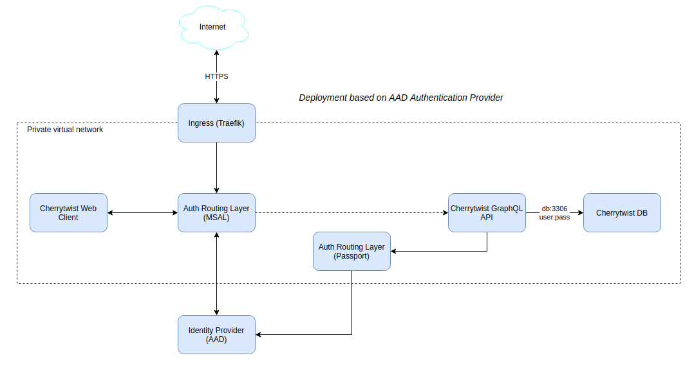
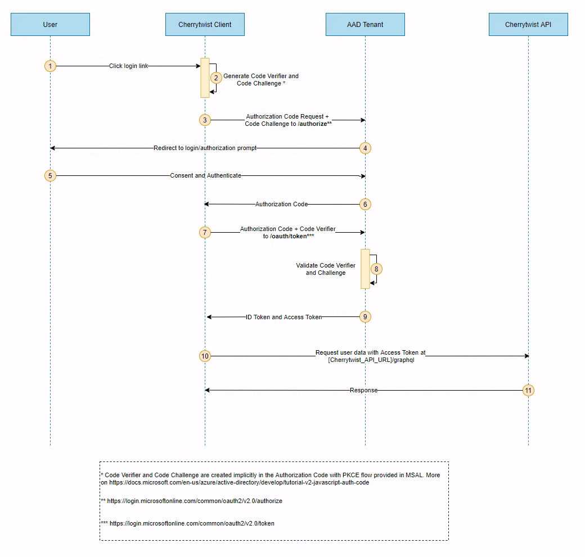
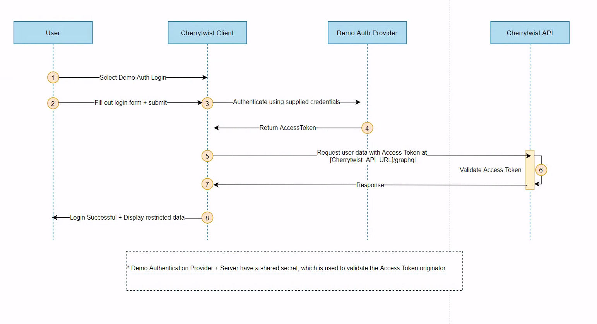

# Cherrytwist Security Design

##	Main design principles
The main principles around the CT security design are:
* HTTPS for transport security on all traffic on public networks
* Minimal network surface exposure – all traffic goes through the Kubernetes Ingress controller
* Authorization is token-based via Identity Provider (at the moment Azure Active Directory)
* Routing to the Identity Provider endpoints is done via standard 3rd party libraries
    * For Cherrytwist Client.Web – Microsoft Authentication Library for JavaScript (e.g. MSAL.js)
    * For Cherrytwist Server – Passport.js
* Database is secured via user:password. The database endpoint is accessible only inside the Kubernetes network.
* Accessing 3rd party APIs requires obtaining API specific access token.

 

Fig.1 Cherrytwist Network Security Overview

##	Authentication
As covered in the [Technical Design](./technical-design.md), Cherrytwist uses the concept of Authentication Providers to externalise the responsibility for Authentication. 

There are currently two supported Authentication Providers:
* Azure Active Directory (AAD): For production usage.
* Demonstration Authentication Provider: For demonstration / development usage. 

Near term the platform will be adding a third, open source production quality authentication provider - stay tuned!

### AAD Authentication Provider Flow
The Cherrytwist AAD Client authentication uses the Authorization Code Flow with Proof Key for Code Exchange(PKCE). It takes advantage of the MSAL.js library built-in integration with AAD. 

Fig.2 AAD Authorization Code Flow with Proof Key for Code Exchange (PKCE)

The main steps of the flow are highlighted on the diagram above. 

Authorization endpoints are configured via config file and environment variables. PKCE is provided by the library. There are two ways to consent (step 5) – either User consent (via callback from AAD) or Admin consent(done directly in the AAD admin portal). After consent is provided the flow continues and two tokens are provided – an ID Token and an Access Token. 

The Access Token is passed as a Bearer token in the Authorization HTTP header (e.g. a header in the form of ‘Bearer [access_token]’). The bearer token is used in the Cherrytwist Server to authorize Cherrytwist API calls.

NB! If any of the calls / callbacks aren’t strictly followed the flow will be altered and it will not work.

### Demo Authentication Provider Flow
The Cherrytwist Demo Client authentication allows user to "register" with the platform and to then interact in an authenticated manner. It is primarily for usage in Demonstrations and for Development - it is **not** for production usage. 

Fig.2 Demo Authentication Provider Flow 

 
##	Authorization
The following roles are used within the context of the Cherrytwist platform:
* **Anonymous** - Able to access non-authenticated elements of the query api. To include ecoverse name/context, list of challenges + for each challenge the context of the challenge. Never be able to access any mutations, nor read access to any details of users / user groups.
* **Registered** - User has a profile and can authenticate. They are able to do self-management for their own profile on the platform but their rights are otherwise the same as Anonymous. 
* **Ecoverse Member** - Able access to the full query api. Able to see community details of the challenges that the user is a member of. Able to edit their own user profile.
* **Ecoverse Community Admin** - Able to add users, add /remove users to groups
* **Ecoverse Admin** - Delete users, create/delete groups, create/delete challenge, able to fill any roles for each challenge
* **Global Admin** - Full access for both Cherrytwist API and AAD.

The above roles are managed via membership of a restricted set of UserGroups at the Ecoverse level i.e. there is a "Community-Admins" group and users that are members of that group will inherit the Community-Admin role. 

On Cherrytwist server startup a file is loaded that specifies a default set of users to go into the authorisation groups.

##	Group mapping to API calls

**Queries**

| Entity     | API Call EndPoint    | Minimum Authorisation Level  | Notes                           |
| -----------| -------------------- | ---------------------------- | ------------------------------- |
| Global   | user           | member | |		
|	 | users	    | member | |
|	 | organisations | anonymous	 |Only the descriptive elements are visible, not the community |
|	 | organisation  | anonymous |	 Only the descriptive elements are visible, not the community |
|	 |	me	        | registered, ecoverse-members	 | User must have an account. |
| Ecoverse   | name           | anonymous | |		
|	 | host         |	anonymous	 | |
|	 | context	    |anonymous	    | |
|	 | community	    |member	    | |
|	 | group	    |member |	  |
|	 | groups       |	member	 | |
|	 | groupsWithTag |	member	 |  |
|	 | challenges   |	anonymous   |	Only the descriptive elements are visible, not the community  |
|	 | challenge	 | anonymous |	Only the descriptive elements are visible, not the community |
| 	 | tagset	    | anonymous	 |  |
| Challenge |	name	        | anonymous	 | |
|  |	context	        | anonymous	 | |
|  |	community	        | member	 | To be visible later restricted further to challenge members|
| Community |	members	        | member	 | |
|  |	groups	        | member	 | |
|  |	applications	        | member	 | |
| Organisation |	name	        | anonymous	 | |
|  |	members	        | member	 | |
|  |	groups	        | member	 | |
 

Note: the above is not a comprehensive list of all fields / entities but it intended to give an overview of the authorisation levels needes to access the different types of information managed by the Cherrytwist server.

**Mutations**

| Entity                        | API Call EndPoint    | Minimum Authorisation Level  | Notes             |
| ----------------------------- | -------------------- | ---------------------------- | ----------------- |
| Platform| 	createUser	| self, community-admin	| | 
| | 	updateUser| 	self, community-admin	| | | | 	removeUser	| community-admin	| | 
| | 	createOrganisation |	ecoverse-admin	| |
| Community| 	createGroupOnCommunity	| community-admin	| | 
| | 	addUserToGroup| 	community-admin	| | 
| |	removeUserFromGroup	| community-admin	| | 
| | 	addUserToCommunity| 	community-admin	| | 
| Ecoverse| 	updateEcoverse	| ecoverse-admin	| | 
| | 	createChallenge	| ecoverse-admin	| | 
| Challenge	| createOpportunity| 	ecoverse-admin	| | 
| | 	updateChallenge	| ecoverse-admin	| | 
| Organisation	| createGroupOnOrganisation	| community-admin	| | 
| | 	updateOrganisation| 	ecoverse-admin	| | 
| Profile	| createTagsetOnProfile	| community-admin	| | 
| | createReferenceOnProfile	| community-admin	| | 
| Tagset	| replaceTagsOnTagset	| community-admin	| | 
| | 	addTagToTagset| 	community-admin	| | 

