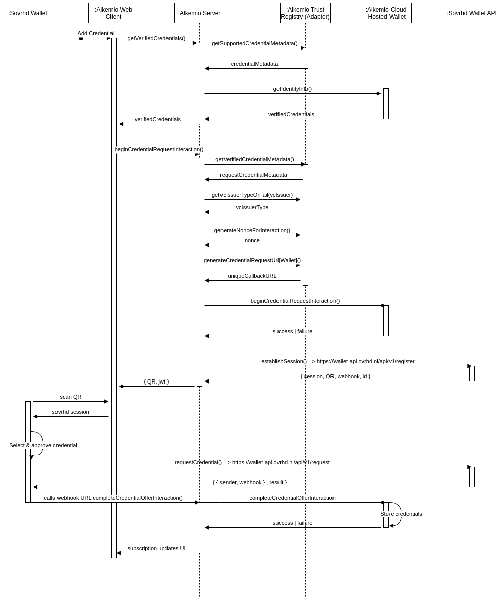

# eSSIF Lab: Sovrhd Wallet support

<p align="center">

</p>


## Interacting with Sovrhd platform
So the steps are:
- First establish a session with Sovrhd server, supplying the callback URL to be embedded in the token scanned by the client. The URL to send the initial request to is: https://wallet-api.ovrhd.nl/api/v1/register with as JSON body a webhook URL. For example: 
> curl -X “POST” “https://wallet-api.ovrhd.nl/api/v1/register”
> -H ‘Content-Type: application/json’
> -d $‘{
> “webhook”: “https://example.test/callback”
> }
 
   - The response from Sovrhd server includs a session token for the session with their server, and that can then be used for api calls:
>{
>"session": "6xPFLdP60lg1SSq4DIg7",
>"webhook": "https://consultenten-portaal.test/api/v1/callback",
>"qr": "data:image/png;base64,iV....
>}

- The QR code to show to the user is shown in the above response.  De QR code is een base64 image. Die kan je direct in een `````` zetten.
- The mobile wallet scans this QR code, the user confirm that the Alkemio request is valid, which then triggers a call to th Sovrhd server
    - Note: this is fundamentally different than the currently supported Jolocom flow, whereby the mobile wallet calls back to the Alkemio server
- The Sovrhd server then invokes the callback URL supplied by Alkemio to validate the session
- The Alkemio server can then use the session it has with the Sovrhd server to request information regarding the credentials on the users mobile

### Interacting with the Sovrhd API
The link to use is: 
https://wallet-api.ovrhd.nl//api/v1/request


> { "session": "6xPFLdP60lg1SSq4DIg7", "data": { "did": "did:dock:5HfD5xmGYZJ1M9aKv1zYbfLo6LbvxqwksCQcCBcsJtPL1a3n", "credentialSchema": [ "blob:dock:5D2nkGSBs56D2ndc2LCMYysTGk61Mb7VLPNMGhF8GsECU2SQ", "blob:dock:5EhtrKUbLdtFKE2CpMYUnjxwZfwgi14AkQZGaQaAVihBKRED”
> ], "type": "request" } }

Note that there are two key pieces of information:
- the DID
- the credenials types to ask for. We will need to store / know these (see below).

Our code:
`{"session":"Tz4V570DPlQMvOiVb1Ug","data":{"did":"did:dock:5HPC8V9ef5BZu1Jbij4YjnMcFV9No68SFKhgkAnpoaf5i3rS","credentialSchema":["blob:dock:5CgrXvgVaUAgzmqW2uUhuonewKmAY8VgVDfyQzziUV2ntGWz","blob:dock:5EoxGBnZ7JVg9kHonEYtz6tfHV5FufL86VEsZ34Ae8ge478n"],"type":"request"}}`
### Using the Sovrhd credentials

To get the meta information for each credential supported by Sovrhd look at the source code for their debugging site:


## Trying it out
If you want to try it out:
1. download the Sovrhd wallet (ios store at least), not sure if there on Android. 
1. issue yourself a credential using the custom URL (https://denhaag-pilot.ovrhd.nl/link/2c1b4f07-2955-46e6-86e6-c473a2b038c7)
1. ensure that SSI is enabled + that the cluster IP address is set to something callable from an external network
    * Note ip address for cluster end point needs to be your external ip address as the call back comes from an external server. So on your router you would need to forward to your local machine. 
1. request the postal address credential on the webclient etc.


## Reference
- Issuing test credentials: https://attributes.vc
- Documentation: https://service.ledgr.nl/docs/
- Debugging usage: https://debug.sovrhd.com
- Link for issuing a Sovrhd credential for living in The Hague: https://denhaag-pilot.ovrhd.nl/link/2c1b4f07-2955-46e6-86e6-c473a2b038c7

> <option value="blob:dock:5GJc2RHYw6tKE47SqAvSRoh5g7tqQx37sdZb2RM8W1j2h9ad">NCOIDemo</option>
>                                                     <option value="blob:dock:5EXTaPAeXJ4A8cSDEfwmrg9pW6egPnjvpmt2TteCBUu493no">ElmoDuo</option>
>                                                     <option value="blob:dock:5DEGLCGsuWLkVrfiCqXTPQQEekt2kibSeyWTdUt35mmsmimn">EmailAddress</option>
>                                                     <option value="blob:dock:5EVe5J5yNCj6hceF5x9JrCDPEEWTQL3zaYCh7EFqy4s9UGtT">mail</option>
>                                                     <option value="blob:dock:5CZYgskpTyHoG3TcU6nNpPXwcnah3t9edKqp8sA3PHDMHiQ6">Burgerservicenummer</option>
>                                                     <option value="blob:dock:5FzC3idrKDkKwmDKKYSwCs4JGmwk6nuPoK2LdduWkvnosiZx">Werkgeversnummer</option>
>                                                     <option value="blob:dock:5Ea4yfFoNSrRT16z49H6BjUv8VtpEfzu7ujyMRyMuAYvR7Qh">Loonstrook</option>
>                                                     <option value="blob:dock:5GQD6kKpFe3E3g1VPGdTNw5E8URs7h2uCUtF2xfxRbdfwFQY">Alumni</option>
>                                                     <option value="blob:dock:5GCpB4zHDLBg7VCUoWqWVDsAbmLTdN9RiJTtKFaB2hNkJgKu">Werkervaring</option>
>                                                     <option value="blob:dock:5CgrXvgVaUAgzmqW2uUhuonewKmAY8VgVDfyQzziUV2ntGWz">hoplrCode</option>
>                                                     <option value="blob:dock:5EoxGBnZ7JVg9kHonEYtz6tfHV5FufL86VEsZ34Ae8ge478n">dutchAddress</option>
>                                                     <option value="blob:dock:5D2nkGSBs56D2ndc2LCMYysTGk61Mb7VLPNMGhF8GsECU2SQ">address</option>
>                                                     <option value="blob:dock:5EhtrKUbLdtFKE2CpMYUnjxwZfwgi14AkQZGaQaAVihBKRED">name</option>
>                                                     <option value="blob:dock:5FLUwmV5eABdfgSQGs9RL7ZpWc4QfHdNyvuKWzaBSyz9zopC">Gemeente</option>
>                                                     <option value="blob:dock:5HM9oAspWkvicXPc9dnvBvJirMYwLn6HV2i8JfdKLyDDk3Tu">Gegevens</option>
>                                                     <option value="blob:dock:5E9meALJpReXR8GyyY1wKB3aCp4LW4bKhnrnQQD6QQjJRx4n">Geboortedatum</option>
>                                                     <option value="blob:dock:5GvXN4nSUWNnubqPqf85m1f8Ee7kqojwHuSTgf2N2DBe3oEX">Leeftijd</option>
>                                                     <option value="blob:dock:5D7QRdAFgK5NQZYZ73hDBXWAtJE22a9Qxu1c3jTsjVKu86Ae">gemeente</option>
>                                                     <option value="blob:dock:5E1LDSjsoTA84m1s6W7pBAfLwenY65nH1g8kf7fdHTsJmaXH">UWVwerkervaring</option>
>                                                     <option value="blob:dock:5ER8iQ7pzZZA9fn4ru8uSGfLb1t2NvHYNtDZQpjdaaGLYEt2">telephonenumber</option>