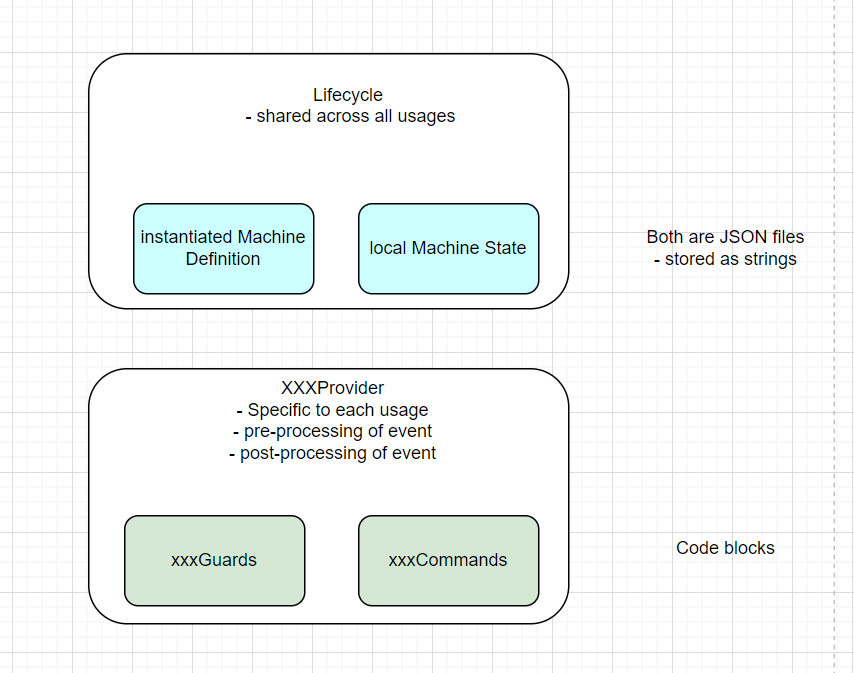
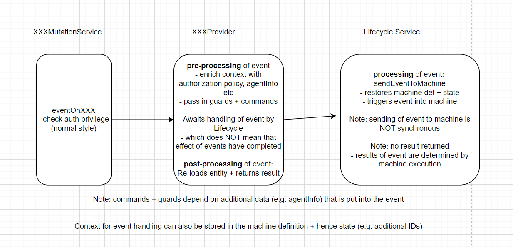

# State Machines and Processes in Alkemio
This technical note covers the implementation + usage of statecharts in Alkemio.

The rational for adding statecharts as a core platform capability is:
* Powerful representation of business logic, bridging development + business
* Allows for shared understanding of progress (“how mature is this challenge? What is the status of my application?”)

## Context
This section covers background material.

### XState
The Statechart implementation is based on XState. This is a powerful open source StateChart implementation with
* Large + growing community
* Strong and expanding tooling 

### Reading
* Simple explanation: https://statecharts.dev/what-is-a-statechart.html
* https://xstate.js.org/ – link to XState site itself
* https://stately.ai/ – all new visual editor that has been developed by new venture Stately
* Formal paper re statecharts: https://www.wisdom.weizmann.ac.il/~harel/papers/Statecharts.pdf

### Usage
Statecharts are already used in the following places:
* Innovation Flow (on Challenge / Opportunity)
* Community membership management via Applications & Invitations
* Organizational Verification
* Whiteboard checkin / checkout

The expectation that over time the usage of Statecharts for implementing and executing the business logic will significantly grow. The current implementation originates from Q2 2021, and ensured that the platform has this highly valuable capability - and over time its usage will expand, it is simply a much stronger logic representation.

### Business driver
The Innovation Flow functionality is at the heart of the platform, guiding users on their journey. It is very basic, with the actual capability offered to users being not more than surfacing up the curent state. 

However there is very strong pull to finally fully implement the vision:
* Supporting customers working through a defined set of states on challenges with their community
* Supporting methodologies such as TheoryU, Doughnut Economics, Digicampus Pipeline etc

Note: for the full implementation of InnovationFlows there is also substantial work required in terms of associating Callouts and actions with States, that is outside the scope of this technical note. 

## Technical Design

The initial implementation dates from April 2021, and our understanding of XState + NestJS / JS constructs then was limited, so there may well be good optimizations to be had. What is there now “sort of works” for the limited usage we now have, but it is fragile (has issues) so to step it up further requires revisiting the implementation.

### Definitions
* **machine**: an executable XState instance
* **machine definition**: state machine setup, instantiated from a template
* **machine state**: the local state of the instantiated machine
* **commands**: business logic blocks
* **guards**: authorization checks

### Lifecycle + Providers
The Lifecycle is the core entity that manages interactions with Statechart machines in Alkemio. It stores the following:
* Serialized machine definition
* Serialized representation of state of the machine

It is also responsible for handling of events in a generic way, and provides fields for querying the underlying machine. 

Each usage of a Lifecycle is supported by a **Provider**, that is responsible for
* doing the event pre + post processing 
* providing the commands / guards that are needed for the machine definition

### Event Handling
When an event comes in, it is handled by a Provider that knows the context for the Lifecycle. 

The steps involved are shown in the diagram below.

To understand the usage, suggest to look at some of the lifecycle definitions in the server codebase e.g. community/invitation/invitation.lifecycle.config.ts. 

Note: 
* Guards need to be synchronous
* Commands can be async

### Future work
* **Extend lifecycle definition**: to add information to make clear what states should be visible to end users etc. 
* **Improved machine management**: 
    * Initiation of machine to initial state is not robust: explicitly initiatialize machine to initial state when create it?
    * Guidelines to ensure do event handling results completes before handing back to Provider. Currently there is potential for race conditions as do not wait for effects of the event to complete
    * Storing of state removes a bunch of data that is not needed, how to do that cleaner?
    * Performance: if start doing more with machines then may want to keep machines alive in shared memory: reduce having the machine loaded for each field
    * Strength typing: code base robustness
* **Removal of Privilege checks in event mutations**: if have guards on all transitions then it is duplication
* **Designablity of state machines in Stately for usage in Alkemio**: to allow more people to be able to create sophisticated machine definitions and manage them
* **Upgrading / management of Machine definitions**: 
    * XState v4 vs v5: A major update of XState is expected Q3 2023. 
* **Management + provision of commands / guards**: A lot of guards in particular will be generic (e.g auth guard). 
    * How to have "libraries" of commands / guards? Can imagine that we end up with e.g. a library of commands for Community entity
    * If have library of commands then need to have validation that expected fields are set on the event as part of pre-processing
    * How does each usage know what guards / commands know are available? Should e.g. the InnovationFlow entity have a list of supported guards / commands that can be used + validate for this when instantiating the provided Lifecycle. 

