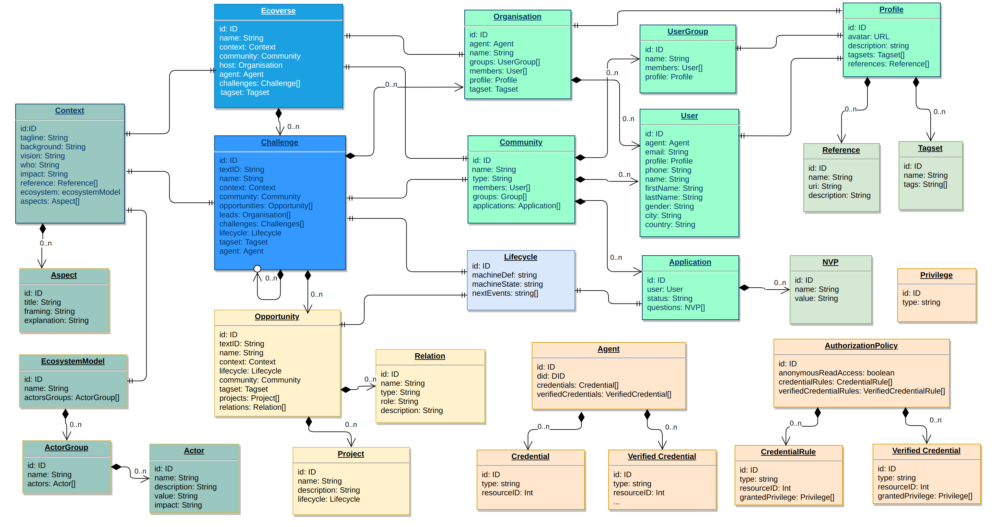
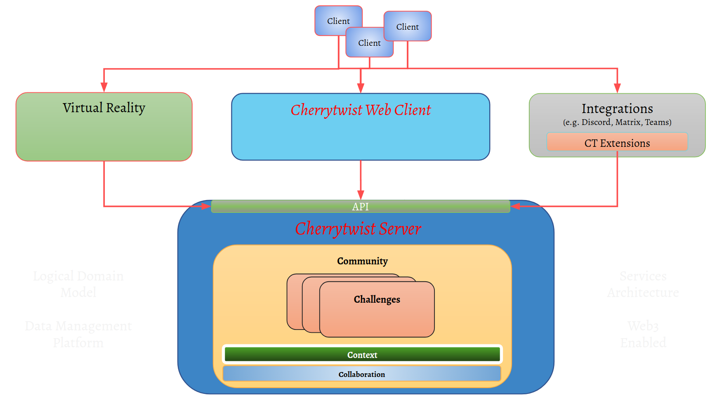
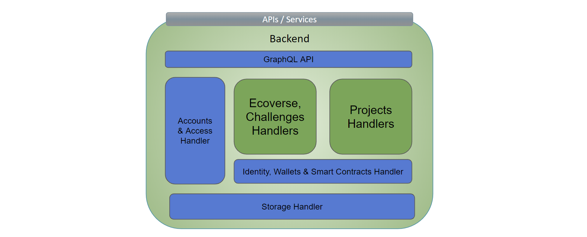

# Cherrytwist - Technical Design Introduction
This document provides an introduction to the technical design for Cherrytwist. It is assumed that the reader has already read the [Conceptual Design](./conceptual-design.md) document. 

The architecture is described along the following aspects:
*   Design Principles
*   Users: Accounts, Identities & Access Management
*   Data model
*   Logical Design
*   Configuration & Deployment

In some cases this document will also provide a rationale for decisions that have been made - and of course the initial reference implementation of Cherrytwist also requires choices to be made regarding actual languages used, hosting, user management stacks etc. 

# Design Principles

The following high level choices guide the technical design:

*   **Build for a decentralized future, but expose in familiar ways**
    *   E.g. web 3 under the hood, but exposed using web 2.3 for the user
    *   Leverage latest proven technical solutions (e.g. SSI, Smart Contracts), but shield the end user from the technical complexity until ready
    *   This implies creating the platform with digital identities (SSI) for all entities in the system with associated wallets etc, but that this is all kept internal to the platform in first versions.
*   **Maintain flexibility to evolve**
    *   In practice this means efforts to minimise / isolate deployment dependencies
    *   The initiative is still learning and evolving, so it is deemed prudent to avoid establishing long term dependencies that may not be the right choice.
*   **Regulated value (e.g. money) out of band i.e. via familiar channels / units**
    *   In case the platform should enable the transfer of regulated value then a whole range of obligations fall on any organisation deploying a Cherrytwist instance - e.g. KYC, AML, insurance etc.
        *   Worth noting that the Ecoverse Host can play a role in this scenario as facilitator of the regulated value exchange e.g. hold money in escrow for stakeholders + then pay parties based on signals from the platform that a Project has completed successfully
    *   Similarly, the Ecoverse Host for now is able to specify the currency to be used in the Ecoverse challenges (e.g. euro, dollar). 
*   **Formalise Trust**
    *   This implies making explicit how agreements are made between actors of the platform, and how the representation of those interactions can be trusted. 
    *   One example of this is the deployment of a smart contract platform within the context of and limited to the Ecoverse. 
        *   Of course any Smart Contract platform is dependent on the network of nodes & their global state for trust. In initial versions the Ecoverse Host would be responsible for running this platform as a standalone island - so not connected to global trust sources e.g. Ethereum main chain.
        *   This ties into earlier principles around building for the future but exposing in familiar paradigms, whilst retaining platform evolution flexibility both from a runtime dependency & upgradability point of view.
*   **Simple to operate**
    *   The platform should be easy to configure, deploy and run - also implying that the number of external dependencies needs to be very carefully managed. 

It is worth noting that some of these choices, especially regarding the Ecoverse Host role in mediating regulated value exchange & trust, are made in the context of getting a first version of Cherrytwist deployable. The expectation is fully that these aspects can be decentralised as the platform and wider context within which it is used matures - and indeed the architecture is set up to ensure that this is feasible in an incremental manner.

# Logical Data Model

The goal of the Cherrytwist platform is to manage the shared representation of Challenges and to faciliate collaboration within the context of those Challenges. To support this, the platform has a *logical data model* for storing the shared representation and for facilitating the collaboration. 

The following diagram shows at a high level the key entities in use within Cherrytwist:

This logical data model attempts to keep to a minimum, at least initially, the set of entities that are represented in the platform, while still being able to reflect the types described in the conceptual design. The rationale for this is to keep the approach as general as possible, allowing further innovation how Challenges are managed. 

The key entities in the model are:
*   **Challenge:**
    * **Ecoverse**: the hosting environment for the Challenges, which has an associated hosting organisation. 
    * **Challenge**: the Challenge itself, including the shared understanding, community and tracked collaboratin. 
    * **Opportunity**: a potential significant step towards the desired outcomes of the Challenge. Likely that multiple Opportunities are identified in the context of the Challenge, each with their own lifecycle & that need to be ranked / prioritised. 
*   **Community**:
    *   **User**: The primary way of interacting with the platform    
    *   **UserGroup**: To allow the aggregation of users into groups, which may or may not have a focal point that is in charge of the group
    *   **Organisation**: To reflect legal entities that interact with the platform via one or more users.   
    *   **Profile**: a shared entity across Users, UserGroups and Organisations to represent their Profile in a consistent way. It manages the avatar of the entity, tagsets giving meta-data about the entity (e.g. industry, skill sets, intersts) and references for links related to the entity (e.g. website of an organisation, linkedin profile for a user etc)
*   **Context**: 
    * **Context**: The shared understanding, at either Ecoverse or Challenge level. 
    * **ActorGroups + Actors**: The different groups of actors who are identified and/or engaged
    * **Aspects**: The aspects to solutions being worked on in the context of the Challenge
*   **Collaboration**: 
    * **Project**: a defined outcome, formalised as an agreement between parties collaborating in the context an Opportunity. Potentially multiple projects needed to deliver an Opportunity.
    * **Relation**: an interaction to be tracked between two Users / Organisations / Groups related to a particular aspect (e.g. Opportunity) within the platform
*   **Agents (SSI)**: 
    * **DID**: the persistent decentralised identifier as per W3C standard
    * **DDO**: The document describing the DID, with roles etc. 

To facilitate flexible usages of this data model, most key entities have **Tagsets** associated with them, allowing for easy filtering + connecting
*   Tags allow for a fairly unstructured entity relationship model to be used in a variety of ways.
*   Tags are held in Tagsets that are named collections of Tags. 

There is also a *physical data model* that is how the logical data model is stored in the underlying datastore. However for using the system that should be hidden from normal usage.

# Logical Design

The logical layers to the Cherrytwist architecture:
*   **Clients**: the actual devices being used to interact by the users 
*   **Interaction**: the user experiences being provided to Users as they interact within the context of an Ecoverse / Challenge
*   **Server**: for managing all aspects of the Ecoverse & Challenge lifecycle

The layering is shown in the following diagram:

## Interaction (aka user interfaces)

The server maintains the long term representation of the Challenge, with which users interact in many different ways over the lifecycle of the Challenge. As such the primary goal of the Interaction Layer is to ensure that many different types of interactions are feasible, while of course also allowing easy adoption of the platform via one or more reference user interfaces.

Examples types of interactions:
*   Dedicated website
*   Mobile clients
*   Immersive game / VR experience
*   Extensions of UX / Web frameworks

For the initial version of Cherrytwist, the focus will be on extending an existing UX / Web framework to be able to expose and represent visually the information maintained with Cherrytwist. 

The interaction layer will be in charge of the following responsibilities:
*   Login/Sign up via SSO
*   Ecoverse navigation
*   Challenge navigation
*   Project initiating and launching
*   Connecting within the community
*   (later) Navigating / connecting between Ecoverses that have established trust relationships.

The interaction layer will typically be a stateless application and will communicate with the backend application via GraphQL API.

## Server

The core of Cherrytwist, facilitating all other aspects of the platform. The core sub-components are shown in the following diagram. 

All interactions with the Server are via a set of APIs / services exposed by the platform, and actions are authorised based on the account associated with the user.
* **Authentication & Authorisation**: Supporting multiple Authentication Providers, and managing User authorisation once they have a valid session. 
* **GraphQL API**: This is the interface to the platform for all data exchange. 
* **Storage Handler**: To manage the different types of storage to be used by the platform. Manage the different platform identities (users, ecoverse, challenges, projects, teams, etc)
* **Identity, Wallets & Smart Contracts Handler**: Typically DIDs are stored as part of a users or identity registry in a decentralized network as part of a Smart Contract state. To reduce the potential dependency with an external blockchain network it could be possible to store the DID and DDO in the general purpose database where the key is the DID and the value is the DDO content. Similarly, initially wallets associated with an identity would be stored in the database but could be later moved to another type of storage. 

### Data Storage

The artifacts managed by the server need to be safely and securely managed by the server. The following are key artifacts to be stored by the platform:
*   **Entities from the data model** i.e. Ecoverse, Challenges & Project state
*   **Digital Identities**, so both the DID & the DDO associated with a DID
*   **Smart Contracts**, on an executable platform
*   **Digital Wallets**, for the management of digital assets such as recognition tokens. Note that no value that falls under regulation would be support initially.

The following locations are identified for the storage of data associated with Cherrytwist:
*   **Database**: for the data and the relationships between the entities, metadata etc. This could be relational or NoSQL based.
*   **Content Addressable Storage (CAS)**: for any images or documents that should be stored in a content addressable (CAS) way, whereby the data is also potentially distributed (resilience etc). Primarily used for now as a Content Distribution Network (CDN).
*   **Ledger**: for smart contracts, and transfer of value. The smart contracts can cover a variety of usages on the platform e.g. execution of projects, digital identities & the definition / control of any tokens created by the Ecoverse.
*   **Vault**: For management of keys in a readily accessible but secure way. 
    *   Note: it may be that later users of the platform would want to store value that would warrant usage of cold storage, but the expectation is that this would be done leveraging a third party service. 

The platform currently has both Database and CAS available - additional storage mechanisms will be added as needed later. 

# Interacting: Users, Agents, Authentication & Authorisation

This section describes the user model that is used for all interactions with Cherrytwist. Key is that this interaction model can work with both existing web paradigms as well as emerging Self Sovereign Identity (SSI) approaches.

## Users
Each User of the platform has a their own profile, which then governs their interactions with the platform. 

## Agents
Each User of the platform, and each entity such as a Challenge or Opportunity, have SSI _Agents_ that the platform manages on their behalf. 

Each Agent can then further have artifacts such as wallets that it controls, and can interact on behalf of the user / entity with other elements of the platform. The usage of Agents is currently largely invisible to Users - but it is critical to setup the platform from the start with Agent based interaction patterns to enable moving more decentralized later.

Critically, all identities (SSI) created by the platform are managed by the platform on behalf of the user i.e. acting as a proxy for actions authorised by the user via their Account. The goal is to have these identities held outside of the platform - but that is in itself a journey with multiple steps on the way.

Worth noting that this hybrid approach also allows platform users to leverages some of the benefits of Self Sovereign Identity (SSI) such as pairwise unique identifiers etc for peer interactions, albeit with the Ecoverse as a trusted party until that trust role is decentralised. 

As aspects of SSI mature the intention is to allow more of the platform interaction and management to be carried out using SSI mechanisms e.g. claims, signing etc. 

The ideal scenario for Users is that ultimately they can have their own SSI that can then control the Agents managed by the platform - or replace the platform Agents. 

## Authentication Providers
To authenticate users, the platform uses the concept of Authentication Providers. An Authentication Provider has the sole responsibility of authenticating users - so that upon authentication the platform knows exactly which User has logged in.

The currently supported Authentication Providers are:
* Azure Active Directory (AAD) - a production, enterprise class Identity Provider from Microsoft.
* Demo Authentication Provider - a non-production authentication provider to show the capabilities of the platform in a lightweight way.

This design is chosen so that in the future users can also authenticate using their own SSI - a topic of [very active development](https://identity.foundation/did-siop/) in the SSI community. 

## Authorisation
Once a User is authenticated, then the platform needs to know what they are authorised to do on the platform.

The current implementation relies on assigning users to one of a number of roles. The currently supported Ecoverse level roles are:
* Member
* Community-admin
* Ecoverse-admin
* Global-admin

Users inherit these roles by being members of User Groups at the Ecoverse level.

There is fine grained control on the GraphQL mutations (api calls) from the Cherrytwist Server based on the roles that the users is assigned. 

However in order to ensure the platform is decentralised, having authorisation managed centrally is not an option. As such the goal is to move towards a model whereby authorisation is based on claims / credentials held by the Agent acting on behalf of a User. 

# Configuration & Deployment

This section details out how an Ecoverse instance is deployed, and then how entities such as Challenges hosted in the Ecoverse are created.

A core driver is to ensure that the platform is configurable, and in a replicable way - both to enable reliably development / deployment but also to ensure that over time a community pool of best practice templates emerges that can be leveraged for new innovations in the field of Cherrytwist.

For this inspiration is taken from other process template environments such as Azure DevOps, GitHub Actions etc. 

## Base Install

The Cherrytwist platform is initially deployed in an “empty” state, without an Ecoverse. It does however already include the following roles:
*   Global admin: able to deploy templates ane manage assignments to key platform roles
*   Ecoverse admin: able to carry out all sub roles, create new user groups etc
*   Community admin: able to manage users, existing user groups, membership of security groups, etc
*   Members: able access to the full query api. Able to see details of the challenges that the user is a member of. Able to edit their own user profile.

The platform is currently limited to have a single Ecoverse deployed onto it. 

## Populating an Ecoverse
This section describes the steps and supporting entities for working with an Ecoverse. 

### Structure
The structural setup of the Ecoverse is held in a “Ecoverse Setup file, external to Cherrytwist that contains:

*   The Identity for the Ecoverse e.g. Odyssey, YES!Delft, OdysseyTest etc
*   The description of the Ecoverse, including all related information such as the Ecoverse Host etc
*   The UserGroups to be used at the Ecoverse level
    *   E.g. Jedis, ChallengeLeads, Crew, …

### Templates
A Template contains Entities that are used by the Ecoverse to create Entities with flexible usage patterns. Examples of the kind of information that could be stored within a Template include:
* Definitions of types of users, such as what tagsets are expected on a particular user type (e.g. skills, interests, ...)
* Challenge states, user groups, ...
* Opportunity aspects, actor groups, ...

The template setup is currently only used for holding User profile setup data, but the approach is designed to be extended and support e.g. having multiple Challenge / Opportunity / Project templates available for selection by Ecoverse users.

The evolution of the Ecoverse instance from deploying a template and then instantiating a challenge is shown below:

#### Challenge, Project & User Group Templates

Further, the following entities will have enhanced templating support:
*   Challenge Template
*   Opportunity Template
*   Project Template
*   Community Template

In particular the Project Template is likely to have multiple variations possible to reflect the multiple ways a project may want to be executed. An Opportunity Lead would then select a template to use when launching the challenge.

These additional templates may be part of the Ecoverse Template or uploaded later, and they initially all require the “global admin” role.

