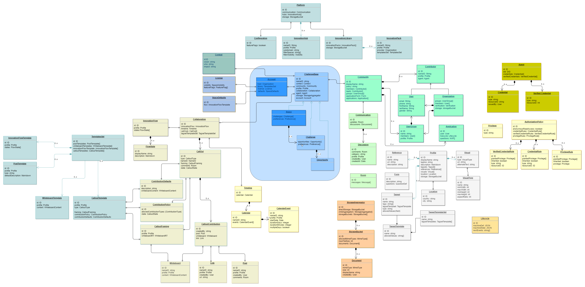

# Alkemio - Technical Design Introduction
This document provides an introduction to the technical design for Alkemio. It is assumed that the reader has already read the [Conceptual Design](./conceptual-design.md) document. 

The architecture is described along the following aspects:
*   Design Principles
*   Logical Data Model
*   Logical Design, and core components
*   Security, Identities & Authorization
*   Identifiers
*   Templates
*   Lifecycles & states

In some cases this document will also provide a rationale for decisions that have been made - and of course the initial reference implementation of Alkemio also requires choices to be made regarding actual languages used, hosting, user management stacks etc. 


# Design Principles

The following high level choices guide the technical design:

*   **Build for a decentralized future, but expose in familiar ways**
    *   E.g. web 3 under the hood, but exposed using web 2.3 for the user
    *   Leverage latest proven technical solutions (e.g. SSI, Smart Contracts), but shield the end user from the technical complexity until ready
    *   This implies creating the platform with digital identities (SSI) for all entities in the system with associated wallets etc, but that this is all kept internal to the platform in first versions.
*   **Build for massive scale, with flexibility to evolve**
    *   Ensure that the core components chosen and how they are used needs to be chosen with massive scale in mind
    *   In practice this means efforts to minimise / isolate deployment dependencies
    *   The initiative is still learning and evolving, so it is deemed prudent to avoid establishing long term dependencies that may not be the right choice.
*   **Regulated value (e.g. money) out of band i.e. via familiar channels / units**
    *   In case the platform should enable the transfer of regulated value then a whole range of obligations fall on any organisation deploying a Alkemio instance - e.g. KYC, AML, insurance etc.
        *   Worth noting that the Ecoverse Host can play a role in this scenario as facilitator of the regulated value exchange e.g. hold money in escrow for stakeholders + then pay parties based on signals from the platform that a Project has completed successfully
    *   Similarly, the Ecoverse Host for now is able to specify the currency to be used in the Ecoverse challenges (e.g. euro, dollar). 
*   **Formalise Trust**
    *   This implies making explicit how agreements are made between actors of the platform, and how the representation of those interactions can be trusted. 
    *   One example of this is the deployment of a smart contract platform within the context of and limited to the Ecoverse. 
        *   Of course any Smart Contract platform is dependent on the network of nodes & their global state for trust. In initial versions the Ecoverse Host would be responsible for running this platform as a standalone island - so not connected to global trust sources e.g. Ethereum main chain.
        *   This ties into earlier principles around building for the future but exposing in familiar paradigms, whilst retaining platform evolution flexibility both from a runtime dependency & upgradability point of view.
*   **Simple to operate**
    *   The platform should be easy to configure, deploy and run - also implying that the number of external dependencies needs to be very carefully managed. 

It is worth noting that some of these choices, especially regarding the Ecoverse Host role in mediating regulated value exchange & trust, are made in the context of getting a first version of Alkemio deployable. The expectation is fully that these aspects can be decentralised as the platform and wider context within which it is used matures - and indeed the architecture is set up to ensure that this is feasible in an incremental manner.

# Logical Data Model

The goal of the Alkemio platform is to manage the shared representation of Challenges and to faciliate collaboration within the context of those Challenges. To support this, the platform has a *logical data model* for storing the shared representation and for facilitating the collaboration. 

The following diagram shows at a high level the key entities in use within Alkemio:

<p align="center">

</p>

This logical data model attempts to keep to a minimum, at least initially, the set of entities that are represented in the platform, while still being able to reflect the types described in the conceptual design. The rationale for this is to keep the approach as general as possible, allowing further innovation how Challenges are managed. 

The key entities in the model are:
*   **Challenge:**
    * **Ecoverse**: the hosting environment for the Challenges, which has an associated hosting organisation. 
    * **Challenge**: the Challenge itself, including the shared understanding, community and tracked collaboratin. 
    * **Opportunity**: a potential significant step towards the desired outcomes of the Challenge. Likely that multiple Opportunities are identified in the context of the Challenge, each with their own lifecycle & that need to be ranked / prioritised. 
*   **Community**:
    *   **User**: The primary way of interacting with the platform    
    *   **UserGroup**: To allow the aggregation of users into groups, which may or may not have a focal point that is in charge of the group
    *   **Organisation**: To reflect legal entities that interact with the platform via one or more users.   
    *   **Profile**: a shared entity across Users, UserGroups and Organisations to represent their Profile in a consistent way. It manages the avatar of the entity, tagsets giving meta-data about the entity (e.g. industry, skill sets, intersts) and references for links related to the entity (e.g. website of an organisation, linkedin profile for a user etc)
*   **Context**: 
    * **Context**: The shared understanding, at either Ecoverse or Challenge level. 
    * **Ecosystem Model**: A representation (model) of the different types of **ActorGroups + Actors**, plus later the value types each receives / brings into the Ecosystem. 
    * **Aspects**: The aspects to solutions being worked on in the context of the Challenge
*   **Collaboration**: 
    * **Project**: a defined outcome, formalised as an agreement between parties collaborating in the context an Opportunity. Potentially multiple projects needed to deliver an Opportunity.
    * **Relation**: an interaction to be tracked between two Users / Organisations / Groups related to a particular Opportunity
*   **Agents**: representing an entity in the platform in interactions with other entities. Entities with Agents include: Users, Organisations, Challenges, Ecoverses etc. 
    * **Credentials**: a list of credentials held by the Agent. Important to note is that there are two types of credentials that can be associated with an Agent (a) simple credentials, which are managed by the platform (b) verified credentials, which are familiar W3C Verified Credentials. 
*   **Authorization Policy**: representing the authorization rules that grant privileges to agents that are interacting with the entity.  
    * **Privilege**: a list of potential Privileges such as Create, Read, Update, Delete, Grant that can be required in any particular interaction. 

To facilitate flexible usages of this data model, most key entities have **Tagsets** associated with them, allowing for easy filtering + connecting
*   Tags allow for a fairly unstructured entity relationship model to be used in a variety of ways.
*   Tags are held in Tagsets that are named collections of Tags. 

There is also a *physical data model* that is how the logical data model is stored in the underlying datastore. However for using the system that should be hidden from normal usage.

# Logical Design

The logical layers in the Alkemio architecture are as follows:
*   **User Interaction**: the user experiences being provided to Users as they interact with the platform.
*   **Platform**: providing the set of services to clients that are interacting with the platform. 

The layering is shown in the following diagram:

<p align="center">

</p>

Note that the platform itself is designed to be able to be used in a "headless" fashion, thus enabling many different types of clients / integrations.

## User Interaction

Users and Organisations interact in many different ways over the lifecycle of the Challenge. As such the primary goal of the Interaction Layer is to ensure that many different types of interactions are feasible, while of course also allowing easy adoption of the platform via one or more reference user interfaces.

Examples types of interactions:
*   Web client (default)
*   Mobile clients
*   Immersive game / VR experience
*   Integrations into other platforms / tooling

The default web client does allow interacting with the full domain model and administrating the platform. However this should be seen in some sense as a default client, with many other types of clients possible and encouraged.  

## Platform
There are multiple components working together in the Alkemio platform, with the Alkemio server being at the heart of all interactions.

<p align="center">

</p>

The core sub-components for the platform are as follows:
*   **Server**: for managing the entities in the domain model, and facilitating the usage of other services
*   **Authentication**: for managing the authentication of Users that are interacting with the platform
*   **Sql Storage**: for storing of databases, including the domain model from the Alkemio server, wallets from SSI, Communications and Identities. 
*   **Content Addressable Storage (CAS)**: for storing of images, documents. Currently this is a private IPFS cluster.
*   **Communications**: for managing all communications happening between entities (e.g. community to user, user to user) in the platform
*   **Self Sovereign Identities (SSI)**: for managing digital identies and wallets for Agents

All interactions with the Server are via the GraphQL api, which in turn relies on the Authentication services to ensure the acting Agent is identified.


# Security, Decentralization & Identity

This section describes how users interact with the platform in a secure manner. 

The key design goals driving the setup below are:
* **Security**: security is critical for a platform that is facilitating the collabration between multiple stakeholders: the trust is needed for interactions.
* **Decentralization ready**: the interaction pattern has to be able to support operating in a decentralized setup. By decentralized in this case we focus on having entities such as Challenges, Opportunities, Users, Organisations being able to interaction *without* being on the same server. The initial implementation does have all entities on the same server, but the interaction pattern has to support being decentralized. 
* **Extendable**: there are many ways that entities (e.g. users) can authenticate themselves, so the design needs to be flexible in terms of how entities are authenticated.  

## Actor Model & Agents
The target interaction pattern is the Actor Model, whereby entities are represented as independent actors that interact via the exchange of messages. This is a [well known approach](https://arxiv.org/vc/arxiv/papers/1008/1008.1459v8.pdf) that matches well to entities interacting in a decentralized manner. 

Core autonomous entities in the platform have an **Agent** that represents that entity in platform interactions. 

Entities with Agents currently are: User, Organisation, Challenge, Ecoverse & Opportunity. 

Each Agent has _Credentials_ which can interact on behalf of the user / entity with other elements of the platform. 

The usage of Agents is currently largely invisible to Users - but it is critical to setup the platform from the start with Agent based interaction patterns to enable moving more decentralized later.

Note: the text below primarily talks about Users for Authentication and Authorization, but the approach is also applicable for other entities with Agents e.g. Challenges, Organisations etc. 

## Authentication Providers
The Authentication of users is handled by Authentication Providers, a pluggable mechanism whereby multiple types of Authentication can be supported by the platform. After succesful Authentication, the platform retrieves the Agent for the User and that Agent is then used to carry out actions on behalf of the User. 

The platform currently supports [Ory Kratos and Ory Oathkeeper](https://ory.sh) for Authentication. The Ory platform is an open source, enterprise class Identity Provider. Note that the platform supports OIDC so that it is straightforward to integrate external authentications, e.g. Github, Google etc, into the platform. 

<p align="center">

</p>

This design is chosen as it essentially isolates the Authentication process from the rest of the platform, so that it can be later extended / adjusted if needed with additional Authentication Providers. In particular one clear goal is to allow users to their own SSI, a topic of [very active development](https://identity.foundation/did-siop/) in the SSI community. 

In essence the Server is protected by Oathkeeper, which then relies on Kratos for the management of the identities (including trusted external authentications) that are allowed to authenticate. This is represented by the Authentication Zone in the diagram - currently only the Alkemio Server works with Oathkeeper / Kratos but as the platform gets more decentralized other services will likely need to also leverage Oathkeeper / Kratos for authenticating incoming requests. 

## Authorization: Credentials
All Authorization within the Alkemio platform is based on Credential Based Authorization. This section will provide a high level overview of this approach. For additional details please [read this document](./credential-based-authorization.md).

<p align="center">

</p>

Essentially upon a User authenticating, the following happens:
* The platform retrieves the Agent that represents that User
* The Credentials held by that Agent are used to decide if the requested action from the User (e.g. Read a Challenge details, update their profile, update a Challenge definition etc) is Authorized. 

Worth noting that this approach also allows for Credentials to be later held outside of the platform e.g. the user holds their own wallet and manages their own credentials. The ideal scenario for Users is that ultimately they can have their own SSI that can then control the Agents managed by the platform - or replace the platform Agents. 


# Templates
A key design goal for Alkemio is the sharing of best practices, so the platform needs to be customizable. This is achieved with Templates.

Templates support is high up the backlog for the platform, as it is important that key entities (e.g. Ecoverse, Challenge, Opportunity, Project etc) can be instantiated based on a particular template. 

Key areas where we expect that templates support will be useful include:
* Lifecycles: what is the lifecycle (also sometimes referred to as process) that your entities should follow? What do each of the states mean? What actions should be triggered e.g. if a Challenge is approved?
* Ecosystem Models: what types of actors / values are being exchanged within the ecosystem?
* Aspects: what are the key aspects for a Challenge / Opportunity that need to be captured within a given Challenge / Opportuntiy?
* Community: what type of community do you intend to create? What User groups make sense?
* Whiteboards: what collaboration canvases should be available and what is the goal of each canvas?
* (later) what are custom credentials / actions that can be carried out within a particular context?

The management of Templates needs to be both at the global level (global catalog), as well as locally controllable i.e. that an Ecoverse can provide a defined set of options (e.g. what Lifecycles can be used).

Currently there is only limited global templates support; if you have suggestions or wish to work with us on this aspect please engage!

# Identifiers + Names

## UUID
Every entity within the platform has a [Universally Unique Identifier (UUID)](https://en.wikipedia.org/wiki/Universally_unique_identifier). 

This is the primary means for identifying entities within the platform.

## NameID
In addition, the platform also uses a human readable identifier for certain entities. This is in addition to the UUID for the entity. 

The NameID is used for the following purposes:
* **Client side URLs**: it is used to generate the URL that uniquely can navigate to that entity e.g. https://hub.alkem.io/ecoverse1/challenge1
* **Human readable**: making it easier to refer to particular entities
* **Automation**: it makes populating of data on the platform easier

Each NameID is unique within a certain scope. The following table shows which entities have a NameID and what is the uniqueness scope.

| Entity      | Uniqueness scope (namespace) |
| ----------- | ----------- |
| User      | Global amongst Users       |
| Organisation   | Global amongst Organisations        |
| Ecoverse   | Global amongst Ecoverses        |
| Challenge   | Within containing Ecoverse         |
| Opportunity   | Within containing Ecoverse         |
| Project   | Within containing Ecoverse         |

Notes:
* This implies that within a particular Ecoverse that the NameIDs for all Challenges, Opportunities and Projects need to be unique. 
* The combination of (Ecoverse.NameID, Challenge.NameID) is sufficient to universally identify a particular Challenge using human friendly names. 

The following rules apply to the creation / usage of a NameID:
* 25 character limit
* allowed characters: a-z, A-Z, 0-9, -
* Must start with a letter (to create regex rule)
NameIDs logically **can** be updated (not initially), but with a warning re URLs being affected etc.


# Lifecycles
As described in the Conceptual Design, the collaboration around a Challenge starts with a shared understanding ('Context'). A key element of that shared understanding is understanding where the Challenge (or other entity) is in terms of its maturity. 

The term used within the Alkemio platform for the managing the maturity of Challenges (+ other entities), as well as to enforce processes / workflows, is **Lifecycle**. 

State based representations are widely used, with Finite State Machines (FSMs) being a formalism whereby a system can be in exactly one from a defined set of states, with clearly defined criteria / rules for when a transition can take place. Examples include Kanban boards, RFCs as well as more formally business process modeling approaches. 

A state based representation is a natural match for collaboration on Challenges – allowing clarity for the multiple parties interacting as it is always clear where the Entity is (exactly one state) as well as the allowed transitions with guards that determine how an Entity moves between the potential States. 

## State Machine
Alkemio uses the [XState](https://xstate.js.org) engine for managing the lifecycle of entities. The embedded XState engine is extremely capable and is widely used. It provides the core state representation syntax, logic and execution.

The XState engine is then wrapped by a *Lifecycle* entity that provides the integration with the Alkemio platform.

<p align="center">

</p>

Each Lifecycle is instantiated with a particular `machine definition` that defines the set of states plus associated logic for that entity. 

It can then accept incoming events, and upon receiving an event, it restores the state of the XState engine and passes the event to the engine with additional context. It also provides a set of hooks for commands and guards:
* The commands are capable of carrying out actions within the wider platform e.g. adding a user to a community. 
* The guards are capable of working with the Authorization Framework to see if a particular command is allowed. 

After executing the command, the Lifecycle then stores the machine state ready for the next incoming event. 

## Declarative Specification

Critically, the separation of the Lifecycle definition using XState allows for the definition of the states  to be declaratively specified. 


For example, consider the following lifecycle definition, used for a very simple Challenge:

```
{
  id: 'challenge-lifecycle-default',
  initial: 'new',
  states: {
    new: {
      on: {
        REFINE: 'beingRefined',
        ABANDONED: 'abandoned',
      },
    },
    beingRefined: {
      on: {
        ACTIVE: 'inProgress',
        ABANDONED: 'abandoned',
      },
    },
    inProgress: {
      on: {
        COMPLETED: 'complete',
        ABANDONED:'abandoned',
      },
    },
    complete: {
      on: {
        ARCHIVE: 'archived',
        ABANDONED: 'abandoned',
      },
    },
    abandoned: {
      on: {
        REOPEN: 'inProgress',
        ARCHIVE: 'archived',
      },
    },
    archived: {
      type: 'final',
    },
  },
}
```
This is visualized in the platform as follows:

<p align="center">

</p>

If you are curious you can also cut and paste the above definition into the [official XState Visualization service](https://xstate.js.org/viz/) and see their visualization of the same definition. 

## Usage
The platform currently uses Lifcycles on the following entities:
* User Applications
* Challenges
* Opportunities

The usage is currently fairly basic as the focus has being on ensuring that the concept is properly embedded within the platform and that it provides a solid foundation for future expansion (as per design principles at the start of this document).

However the expectation is to expand the usage significantly as soon as resources / demand allows:
* Custom Lifecycle definitions
* Attaching guards / commands to state transitions
* Expanding the set of Commands / guards e.g. to allow notifications
* ...

## SSI Demonstrator
There is already a demonstrator to illustrate the power of this approach, and how it can be integrated with SSI / VCs.

For this scenario the following was demonstrated:
* An Agent acting on behalf of a Challenge issued a VC for "LifecycleStateManagement" to a particular User
* The Agent acting on behalf of the User then stores that VC into its digital wallet (SSI)
* The logic for the Lifecycle for the Challenge was updated to include a new guard that was executed on all state transitions for a Challenge Lifecycle. 
* The new guard specified that only Agents with an assigned VC of the above type and tied to the particular Challenge were allowed to update the Challenge state.