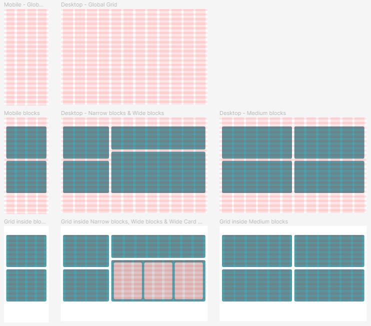
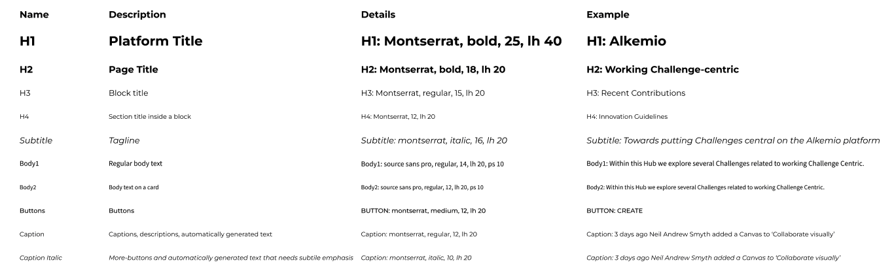
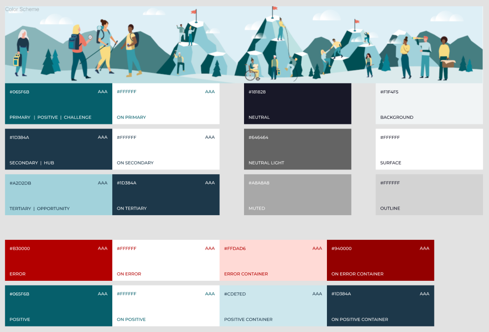

# Alkemio's Design System
Alkemio uses a gridsystem to align the sections of each page:
* Horizontally: each page uses a number of columns
* Vertically: all heights are a multiple of an underlying step size, which is 20px. 

## Composition
Information is displayed in blocks on the page. Each block takes a fixed amount of columns. 

### Global Grid

| Breakpoint     | Columns | Gutter (v) | Min. Margins (v) | Rows | Line height & Gutter | Maximum width |
|:-------------- | ------- | ---------- |:---------------- | ---- |:-------------------- |:------------- |
| 0-599 (Mobile) | 4       | 20px       | 20px             | Auto | 20px                 | 559           |
| 600+           | 12      | 20px       | 20px             | Auto | 20px                 | 1360          |

### Blocks
| Breakpoint        | Block Type       | Takes no. of columns of the global grid |
|:----------------- | ---------------- |:--------------------------------------- |
| 0-599 px (Mobile) | Narrow block     | 4                                       |
| 0-599 px (Mobile) | Wide block       | 4                                       |
| 0-599 px (Mobile) | Wide block Cards | 4                                       |
| 0-599 px (Mobile) | Medium block     | 4                                       |
| 600+              | Narrow block     | 4                                       |
| 600+              | Medium block     | 6                                       |
| 600+              | Wide block       | 8                                       |
| 600+              | Wide block Cards | 8                                       |

### Grid inside blocks

| Breakpoint        | Block Type       | Columns | Margins (v) & Gutter | Rows | Line height & Gutter |
|:----------------- | ---------------- | ------- | -------------------- | ---- | -------------------- |
| 0-599 px (Mobile) | Narrow block     | 4       | 20px                 | Auto | 20px                 |
| 0-599 px (Mobile) | Medium block     | 4       | 20px                 | Auto | 20px                 |
| 0-599 px (Mobile) | Wide block       | 4       | 20px                 | Auto | 20px                 |
| 0-599 px (Mobile) | Wide block Cards | 4       | 20px                 | Auto | 20px                 |
| 600+              | Narrow block     | 4       | 20px                 | Auto | 20px                 |
| 600+              | Medium block     | 6       | 20px                 | Auto | 20px                 |
| 600+              | Wide block       | 8       | 20px                 | Auto | 20px                 |
| 600+              | Wide block Cards | 9       | 20px                 | Auto | 20px                 |

### Visualization

### Scroll bars

Scroll bars go inside the right margin of the page or block. The width is 0.75% of the screen width, with a minimum of 8px and maximum of 16px. In the mockup designs we use 16 px for the whole screen and 8px for scroll bars within blocks.

## Fonts
Alkemio uses the following text styles:

| Name     | Used as                                              | Font            | Style               | Weight | Size | Line Height | Paragraph Spacing |
| -------- | ---------------------------------------------------- |:--------------- |:------------------- | ------ | ---- | ----------- | ----------------- |
| H1       | Platform Title                                       | Montserrat      | Bold                | 700    | 25   | 40          |                   |
| H2       | Plage Title                                          | Montserrat      | Bold                | 700    | 18   | 20          |                   |
| H3       | Block Title                                          | Montserrat      | Regular             | 400    | 15   | 20          |                   |
| H4       | Section Title inside block                           | Montserrat      | Regular             | 400    | 12   | 20          |                   |
| Subtitle | Tagline                                              | Montserrat      | Italic              | 400    | 16   | 20          |                   |
| Body1    | Regular body text                                    | Source Sans Pro | Regular             | 400    | 14   | 20          | 10                |
| Body2    | Body text on a card                                  | Source Sans Pro | Regular             | 400    | 12   | 20          | 10                |
| Buttons  | Buttons                                              | Montserrat      | Medium, Capitalized | 500    | 12   | 20          |                   |
| Caption  | Captions, descriptions, automatically generated text | Montserrat      | Regular             | 400    | 12   | 20          |                   |

## Colors

| Name                  | Color # |                                                                   | Usage                                            |
| --------------------- |:------- | ----------------------------------------------------------------- | ------------------------------------------------ |
| Primary               | #065F6B |  | Key elements                                     |
| On Primary            | #FFFFFF |  | Text/items on elements with a primary color      |
| Secondary             | #1D384A |  | Secondary elements                               |
| On Secondary          | #FFFFFF |  | Text/items on elements with a secondary color    |
| Tertiary              | #A2D2DB |  | Tertiary elements                                |
| On Tertiary           | #1D384A |  | Text/items on elements with a tertiary color     |
|                       |         |                                                                   |                                                  |
|                       |         |                                                                   |                                                  |
|                       |         |                                                                   |                                                  |
| Neutral               | #181828 |  | Text and shadows                                 |
| Neutral Light         | #646464 |  | Secondary text                                   |
| Muted                 | #ABABAB |  | Disabled text                                    |
|                       |         |                                                                   |                                                  |
|                       |         |                                                                   |                                                  |
|                       |         |                                                                   |                                                  |
| Background            | #DEEFF6 |  | Background                                       |
| Surface               | #FFFFFF |  | Blocks and Cards                                 |
| Outline               | #D3D3D3 |  | Border of blocks                                 |
|                       |         |                                                                   |                                                  |
|                       |         |                                                                   |                                                  |
|                       |         |                                                                   |                                                  |
| Error                 | #B30000 |  | Warnings and error messages                       |
| On Error              | #FFFFFF |  | Text/items on elements with an error color       |
| Error Container       | #FFDAD6 |  | Container for warnings and error messages        |
| On Error Container    | #940000 |  | Text/small items on Error container              |
| Positive              | #065F6B |  | Success messages                                 |
| On Positive           | #FFFFFF |  | Text/items on elements with an positive color    |
| Positive Container    | #CDE7ED |  | Container for positive messages                  |
| On Positive Container | #1D384A |  | Text/small items on Positive container           |
|                       |         |                                                                   |                                                  |
|                       |         |                                                                   |                                                  |
|                       |         |                                                                   |                                                  |
| Hub                   | #1D384A |  | (later)                                          |
| On Hub                | #FFFFFF |  | Text/items on elements with a Hub color          |
| Challenge             | #065F6B |  | (later)                                          |
| On Challenge          | #FFFFFF |  | Text/items on elements with a Challenge color    |
| Opportunity           | #A2D2DB |  | (later)                                          |
| On Opportunity        | #1D384A |  | Text/items on elements with an Opportunity color |

## Basic Style Guide
Alkemio uses a variety of components which can be found in the Figma Library (link will follow). The main elements of the most used components are specified below.

|                  | Block    | Card     | Contained Button | Outlined Button | Text Button |
| ---------------- | -------- | -------- | ---------------- | --------------- | ----------- |
| Corner Radius    | 12px     | 12px     | 8px              | 8px             | -           |
| Background color | surface  | surface  | primary          | -               | -           |
| Border size      | 1px      | 0px      | -                | 1px             | -           |
| Border color     | outline  |          | -                | primary         | -           |
| Text color       | may vary | may vary | on primary       | primary         | primary     |
| Elevation        | no       | yes      | no               | no              | -           |

## Components and customizations
The web application uses a component library that is built on top of the [Material UI principles](https://material.io/). The library is https://mui.com/. All components that are used in the application and style overrides need to be listed. Designs should be based on the component library for easier adaptation during the development phase.

