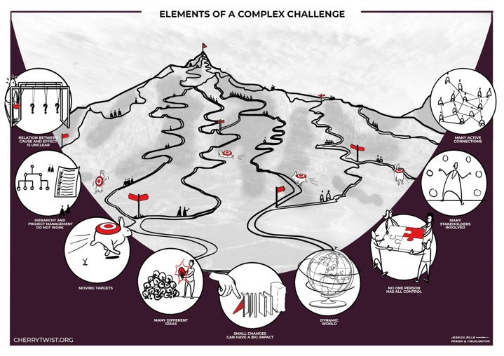
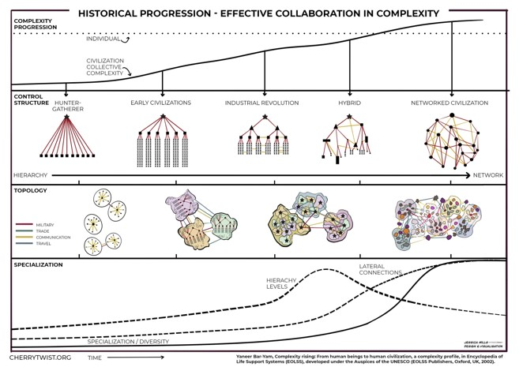
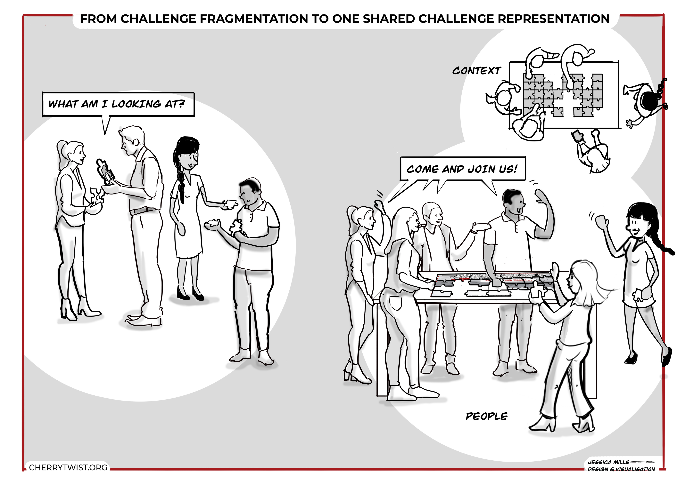

# Why to we need an open innovation platform? And why are Challenges central?
Good questions, lets start with the core concept...

## What is a Challenge? 
A Challenge is any dissatisfaction with current reality. Where are we now and what would we like to change?

A Challenge requires multiple parties to coordinate their activities over a longer period to make progress. 
A Challenge is complex, typically spanning multiple organisational boundaries.

Challenges arise from all aspects of society: whether we’re talking about UN Sustainable Development Goals (SDGs), climate change, corporates trying to innovate with purpose for a sustainable future, governments at any level engaging with their citizens, or a local community working together for a common interest.  

## Why do we need to manage Challenges effectively?
The complexity of our society is simply rising. The result is nearly all the significant issues facing our society are Challenges.

 

However managing Challenges currently is hard:
* Alignment
* Ad-hoc tooling
* Many parties involved, different backgrounds
* Ensuring lifecycle continuity
* Fragmented best practices / community 
* Facilitating collaboration & tracking progress
* Perceptions & agendas
* ...

Society needs to be able to more effectively collaborate to address the Challenges we increasingly face. 

## What does Alkemio Platform enable?

The Alkemio Platform manages a shared representation of a Challenge, which has the following core aspects:
* **What do we want to change?**: the shared representation (**context**) of the desired outcomes and current understanding. 
* **Who wants to contribute?**: the people and organisations (**community**) that wish to collaborate within the shared context. 
* **How do we effectively collaborate?**: making it easier to work together (**collaboration**) towards the desired outcomes. 
* **How to we find similar Challenges? Who can help?**: making it easier to find similar Challenges (**connect**) and talent to help make progress. 
* **How we manage the full lifecycle?**: explicitly managing the phases so that the focus is on the results, not steps on the journey (**continuity**) 

Critically by putting the Challenge central, and managing a portfolio of Challenges via a plaform, this enables the following:
* **Community & Capabilities**: being able to connect and grow a motivated community around the desired outcomes. Being able to find and connect to the right people who have the capabilities and are motivated to contribute. Ensuring that all citizens or organisations that wish to contribute are able to effectively do so.
* **Collaboration**: make it easy for parties to collaborate towards the desired outcomes. Used the share understanding and community to enable low thresholds to effective collaboration.
* **Full lifecycle**:  a Challenge is a journey with multiple stages, and needs to be managed as such. The shared representation, community and collaboration all evolve as the Challenge evolves.
* **Best practices**: the complexity of Challenges means that we need to systematically be able to share patterns and approaches that are demonstrated to work in various situations, from phased approaches through to methods for surfacing up the inherent complexity or coming to an agreed shared understanding.
* **Governance & Oversight**: being able to manage a portfolio of Challenges, with confidence that agreed governance / processes are being followed. Setting clear principles and boundaries for the collaboration that takes place.
* **Trust & Transparency**: a neutral, trusted base from which all parties can confidently interact without fear of being at a disadvantage or seeing value capture unfairly by other parties.
* **Awareness & Visibility**: being able to promote the set of Challenges within a particular context and to share in a controlled way information about both the desired outcomes and the progress towards them.

If you are interested in getting involved please reach out and connect via <info@alkem.io>!